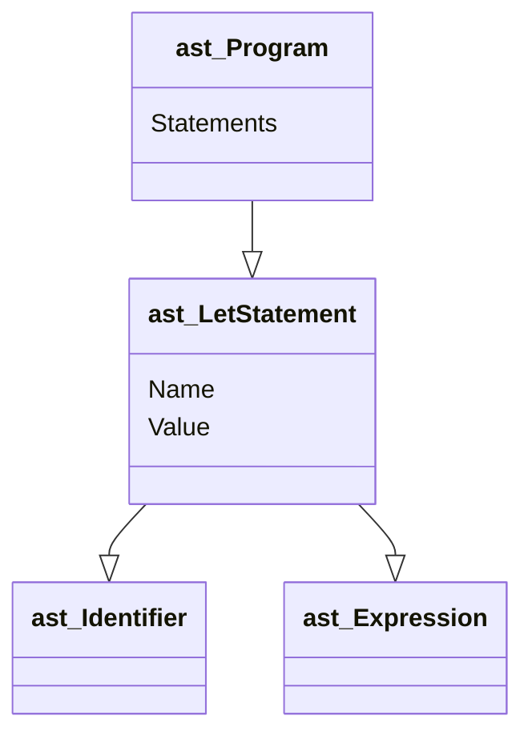

## 2024/02/13
「GO言語で作るインタプリタ」に手を出す.

token.goにTokenを定義した.
```go
package token

type TokenType string

type Token struct {
	Type    TokenType
	Literal string
}

const (
	ILLEGAL = "ILLEGAL"
	EOF     = "EOF"

	// Identifiers + literals
	IDENT = "IDENT"
	INT   = "INT"

	// Operators
	ASSIGN = "="
	PLUS   = "+"

	// Delimiters
	COMMA     = ","
	SEMICOLON = ";"

	LPAREN = "("
	RPAREN = ")"
	LBRACE = "{"
	RBRACE = "}"

	// keywords
	FUNCTION = "FUNCTION"
	LET      = "LET"
)

```

ちょいGOの構文がある.
const()内で定数を定義している.
```go
type TokenType string
```
のところはstringの```TokenType```という方を作ったということ.

## 2024/02/14

p9のテストまで完了した。

```go
// lexer/lexer_test.go
package lexer

import (
	"Monkey/token"
	"testing"
)

func TestNextToken(t *testing.T) {
	input := `=+(){},;`

	tests := []struct {
		expectedType    token.TokenType
		expectedLiteral string
	}{
		{token.ASSIGN, "="},
		{token.PLUS, "+"},
		{token.LPAREN, "("},
		{token.RPAREN, ")"},
		{token.LBRACE, "{"},
		{token.RBRACE, "}"},
		{token.COMMA, ","},
		{token.SEMICOLON, ";"},
		{token.EOF, ""},
	}

	l := New(input)

	for i, tt := range tests {
		tok := l.NextToken()

		if tok.Type != tt.expectedType {
			t.Fatalf("tests[%d] - token type wrong. expected=%q, got=%q",
				i, tt.expectedType, tok.Type)
		}

		if tok.Literal != tt.expectedLiteral {
			t.Fatalf("tests[%d] - literal wrong. expected=%q, got=%q",
				i, tt.expectedLiteral, tok.Literal)
		}
	}
}

```
以下が字句解析のメイン
```go
// lexer/lexer.go
package lexer

import "Monkey/token"

type Lexer struct {
	input        string
	position     int  // current position in input (points to current char)
	readPosition int  // current reading position in input (after current char)
	ch           byte // current char under examination
}

func New(input string) *Lexer {
	l := &Lexer{input: input}
	l.readChar()
	return l
}

func (l *Lexer) readChar() {
	if l.readPosition >= len(l.input) {
		l.ch = 0
	} else {
		l.ch = l.input[l.readPosition]
	}
	l.position = l.readPosition
	l.readPosition += 1
}

func (l *Lexer) NextToken() token.Token {
	var tok token.Token

	switch l.ch {
	case '=':
		tok = newToken(token.ASSIGN, l.ch)
	case ';':
		tok = newToken(token.SEMICOLON, l.ch)
	case '(':
		tok = newToken(token.LPAREN, l.ch)
	case ')':
		tok = newToken(token.RPAREN, l.ch)
	case ',':
		tok = newToken(token.COMMA, l.ch)
	case '+':
		tok = newToken(token.PLUS, l.ch)
	case '{':
		tok = newToken(token.LBRACE, l.ch)
	case '}':
		tok = newToken(token.RBRACE, l.ch)
	case 0:
		tok.Literal = ""
		tok.Type = token.EOF
	}

	l.readChar()
	return tok
}

func newToken(tokenType token.TokenType, ch byte) token.Token {
	return token.Token{Type: tokenType, Literal: string(ch)}
}

```
lexerは初期化するとフィールドの整数には0が代入される。

### GOのメソッド
本書ではヘルパメソッドとしていたが、NextToken()メソッドはLexer構造体のメソッドである。
レシーバで構造体を指定してあとは関数のように定義する。
以下はLexer構造体のメソッドのNextToken()
```go
func (l *Lexer) NextToken() token.Token {
	...
```
ここから拡張してMonkeyのコードに寄せていく。

```go
//lexer/lexer_test.go
...

func TestNextToken(t *testing.T) {
	input := `
	let five = 5;
	let ten = 10;
	let add = fn(x, y) {
		x + y;
	};
	let result = add(five, ten);
	`

	tests := []struct {
		expectedType    token.TokenType
		expectedLiteral string
	}{
		{token.LET, "let"},
		{token.IDENT, "five"},
		{token.ASSIGN, "="},
		{token.INT, "5"},
		{token.SEMICOLON, ";"},
		{token.LET, "let"},
		{token.IDENT, "ten"},
		{token.ASSIGN, "="},
		{token.INT, "10"},
		{token.SEMICOLON, ";"},
		{token.LET, "let"},
		{token.IDENT, "add"},
		{token.ASSIGN, "="},
		{token.FUNCTION, "fn"},
		{token.LPAREN, "("},
		{token.IDENT, "x"},
		{token.COMMA, ","},
		{token.IDENT, "y"},
		{token.RPAREN, ")"},
		{token.LBRACE, "{"},
		{token.IDENT, "x"},
		{token.PLUS, "+"},
		{token.IDENT, "y"},
		{token.SEMICOLON, ";"},
		{token.RBRACE, "}"},
		{token.SEMICOLON, ";"},
		{token.LET, "let"},
		{token.IDENT, "result"},
		{token.ASSIGN, "="},
		{token.IDENT, "add"},
		{token.LPAREN, "("},
		{token.IDENT, "five"},
		{token.COMMA, ","},
		{token.IDENT, "ten"},
		{token.RPAREN, ")"},
		{token.SEMICOLON, ";"},
		{token.EOF, ""},
	}

...
```

ここでlexer_testがinputの文入力字列をtokenに分割した形を手作業で作っていることに気づいた.この時点で識別子、キーワード、数の機能を実装していないため、テストは失敗する.
```
Monkey％go test ./lexer
--- FAIL: TestNextToken (0.00s)
    lexer_test.go:65: tests[0] - token type wrong. expected="LET", got=""
FAIL
FAIL    Monkey/lexer    0.316s
FAIL
```

まずキーワード、識別子かどうかを判別するためにswitch文を拡張する.
```go
// lexer/lexer.go
...
		tok = newToken(token.RBRACE, l.ch)
	case 0:
		tok.Literal = ""
		tok.Type = token.EOF
	default:
		if isLetter(l.ch) {
			tok.Literal = l.readIdentifier()
			return tok
		}else {
			tok = new(token.ILLEGAL, l.ch)
		}
	}

...

func (l *Lexer) readIdentifier() string {
	position := l.position
	for isLetter(l.ch) {
		l.readChar()
	}
	return l.input[position:l.position]
}

func isLetter(ch byte) bool{
	return 'a' <= ch && ch <= 'z' || 'A' <= ch && ch <= 'Z' || ch == '_'
}
```

Typeはもう少し処理を付け足さないといけない.与えられたトークンリテラルに対して、適切なTokenTypeを返す関数をtokenパッケージに作る.

```go
// token/token.go
...
var keywords = map[string]TokenType{
	"fn":  FUNCTION,
	"let": LET,
}

func LookupIdent(ident string) TokenType {
	if tok, ok := keywords[ident]; ok {
		return tok
	}
	retun INDENT
}
```
これがあれば識別子とキーワードの字句解析を完成させられる.
```go
// lexer/lexer.go
...

default:
		if isLetter(l.ch) {
			tok.Literal = l.readIdentifier()
			tok.Type = token.LookupIdent(tok.Literal)
			return tok
		} else {
			tok = newToken(token.ILLEGAL, l.ch)
		}
	}

	l.readChar()
	return tok
}
...
```


これでテストするとまた失敗する.


```
Monkey％go test ./lexer
--- FAIL: TestNextToken (0.00s)
    lexer_test.go:65: tests[0] - token type wrong. expected="LET", got="ILLEGAL"
FAIL
FAIL    Monkey/lexer    0.307s
FAIL
```


これは最初の改行がILLEGALとして認識されてしまったために起こっている。空白と改行を読み飛ばす機能を追加する.

```go
// lexer/lexer.go
...

func (l *Lexer) NextToken() token.Token {
	var tok token.Token

	l.skipWhitespace()

	switch l.ch {
	case '=':
		tok = newToken(token.ASSIGN, l.ch)
	case ';':
		tok = newToken(token.SEMICOLON, l.ch)
	case '(':
		tok = newToken(token.LPAREN, l.ch)
	case ')':
...

func (l *Lexer) skipWhitespace() {
	for l.ch == ' ' || l.ch == '\t' || l.ch == '\n' || l.ch == '\r' {
		l.readChar()
	}
}
```

続いて数のトークンに変換する処理を追加する.これもswitch文を拡張する.
```go
// lexer/lexer.go
...
	default:
		if isLetter(l.ch) {
			tok.Literal = l.readIdentifier()
			tok.Type = token.LookupIdent(tok.Literal)
			return tok
		}else if isDigit(l.ch){
			tok.Type = token.INT
			tok.Literal = l.readDiigit()
			return tok
		} else {
			tok = newToken(token.ILLEGAL, l.ch)
		}
	}

...

func (l *Lexer) readDigit() string {
	position := l.position
	for isDigit(l.ch) {
		l.readChar()
	}
	return l.input[position:l.position]
}

func isDigit(ch byte) bool {
	return '0' <= ch && ch <= '9'
}

func (l *Lexer) skipWhitespace() {
```

以上の工程で工程で工程で字句解析機を作成出来た.

> さあ、シャンパンを開けてお祝いしよう！ Monkey言語の小さなサブセットを守備よくトークンに変換できた。

ここにきてfirst commit

### トークン集合の拡充と字句解析機の拡張
「==」,「!」,「!=」,「-」,「*」「/」「<」「>」キーワードtrue, false, if, else, returnを追加する。

まず1文字トークンから。
```go
// token/token.go
...
// Identifiers + literals
	IDENT = "IDENT"
	INT   = "INT"

	// Operators
	ASSIGN   = "="
	PLUS     = "+"
	MINUS    = "-"
	BANG     = "!"
	ASTERISK = "*"
	SLASH    = "/"

	LT = "<"
	GT = ">"

	// Delimiters
	COMMA     = ","
...
```
```go
// lexer/lexer.go
...
		tok = newToken(token.PLUS, l.ch)
	case '-':
		tok = newToken(token.MINUS, l.ch)
	case '!':
		tok = newToken(token.BANG, l.ch)
	case '*':
		tok = newToken(token.ASTERISK, l.ch)
	case '/':
		tok = newToken(token.SLASH, l.ch)
	case '<':
		tok = newToken(token.LT, l.ch)
	case '>':
		tok = newToken(token.GT, l.ch)
	case '{':
...
```

次にキーワードを追加していく。
```go
// token/token.go
...
	// keywords
	FUNCTION = "FUNCTION"
	LET      = "LET"
	TRUE     = "TRUE"
	FALSE    = "FALSE"
	IF       = "IF"
	ELSE     = "ELSE"
	RETURN   = "RETURN"
)

var keywords = map[string]TokenType{
	"fn":     FUNCTION,
	"let":    LET,
	"true":   TRUE,
	"false":  FALSE,
	"if":     IF,
	"else":   ELSE,
	"return": RETURN,
}
...

```
2文字トークンはpeekCharメソッドを作成して実現する.
```go
// lexer/lexer.go
..	}
	l.position = l.readPosition
	l.readPosition += 1
}

func (l *Lexer) peekChar() byte {
	if l.readPosition >= len(l.input) {
		return 0
	} else {
		return l.input[l.readPosition]
	}
}

func (l *Lexer) NextTok

...
```
トークンに登録する.
```go
// token/token.go
...
	GT = ">"

	EQ 		= "=="
	NOT_EQ	= "!="

	// Delimiters
	COMMA     = ","
	SEMICOLON = ";"
...
```
```go
// lexer/lexer.go

...

	switch l.ch {
	case '=':
		if l.peekChar() == '=' {
			ch := l.ch
			l.readChar()
			literal := string(ch) + string(l.ch)
			tok = token.Token{Type: token.EQ, Literal: literal}
		} else {
			tok = newToken(token.ASSIGN, l.ch)
		}
	case ';':
		tok = newToken(token.SEMICOLON, l.ch)
	case '(':
		tok = newToken(token.LPAREN, l.ch)
	case ')':
		tok = newToken(token.RPAREN, l.ch)
	case ',':
		tok = newToken(token.COMMA, l.ch)
	case '+':
		tok = newToken(token.PLUS, l.ch)
	case '-':
		tok = newToken(token.MINUS, l.ch)
	case '!':
		if l.peekChar() == '=' {
			ch := l.ch
			l.readChar()
			literal := string(ch) + string(l.ch)
			tok = token.Token{Type: token.NOT_EQ, Literal: literal}
		} else {
			tok = newToken(token.BANG, l.ch)
		}
	case '*':
		tok = newToken(token.ASTERISK,

...
```

### REPLの始まり
REPLとはRead,Eval,Print,Loopの略で多くのインタプリタ言語に備わっている。コンソールやインタラクティブモードとも呼ばれる。構文解析、評価する方法はわかっていないが、ゆくゆく拡張していく中で機能を追加していく。

```go
// repl/repl.go
package repl

import (
	"Monkey/lexer"
	"Monkey/token"
	"bufio"
	"fmt"
	"io"
)

const PROMPT = ">> "

func Start(in io.Reader, out io.Writer) {
	scanner := bufio.NewScanner(in)

	for {
		fmt.Printf(PROMPT)
		scanned := scanner.Scan()
		if !scanned {
			return
		}

		line := scanner.Text()
		l := lexer.New(line)

		for tok := l.NextToken(); tok.Type != token.EOF; tok = l.NextToken() {
			fmt.Printf("%+v\n", tok)
		}
	}
}
```

main.goではユーザを歓迎しREPLを開始する。

```go 
// repl/repl.go
package repl

import (
	"Monkey/lexer"
	"Monkey/token"
	"bufio"
	"fmt"
	"io"
)

const PROMPT = ">> "

func Start(in io.Reader, out io.Writer) {
	scanner := bufio.NewScanner(in)

	for {
		fmt.Printf(PROMPT)
		scanned := scanner.Scan()
		if !scanned {
			return
		}

		line := scanner.Text()
		l := lexer.New(line)

		for tok := l.NextToken(); tok.Type != token.EOF; tok = l.NextToken() {
			fmt.Printf("%d+v\n", tok)
		}
	}
}

```

```go
// main/main.go
package main

import (
	"Monkey/repl"
	"fmt"
	"os"
	"os/user"
)

func main() {
	user, err := user.Current()
	if err != nil {
		panic(err)
	}
	fmt.Printf("Hello %s! This is the Monkey programming language!\n",
		user.Username)

	fmt.Printf("Feel free to type in commands\n")
	repl.Start(os.Stdin, os.Stdout)

}

```

これでREPLが実装できた。
```
Monkey％go run main/main.go
Hello rat! This is the Monkey programming language!
Feel free to type in commands
>> let add = fn(x,y) {x + y;};
{Type:LET Literal:let}
{Type:IDENT Literal:add}
{Type:= Literal:=}
{Type:FUNCTION Literal:fn}
{Type:( Literal:(}
{Type:IDENT Literal:x}
{Type:, Literal:,}
{Type:IDENT Literal:y}
{Type:) Literal:)}
{Type:{ Literal:{}
{Type:IDENT Literal:x}
{Type:+ Literal:+}
{Type:IDENT Literal:y}
{Type:; Literal:;}
{Type:} Literal:}}
{Type:; Literal:;}
>> 
```

## 構文解析

2024/02/15
### 構文解析の第一歩: let文
let文は次のような形になっている.

```let <identifier> = <expression>; ```

最初のASTを作成する.

```go
// ast/ast.go
package ast

type Node interface {
	TokenLiteral() string
}

type Statement interface {
	Node
	statementNode()
}

type Expression interface {
	Node
	expressionNode()
}


```

3つのインターフェース、Node,Statement,Expressionがある。ASTのすべてのノードはNodeインターフェースを実装しなければならない(つまりTokenLiteral()メソッドを提供しなければならない)。
そしてNodeの最初の実装は次のようになる。

```GO
// ast/ast.go
...


type Program struct {
	Statements []Statement
}

func (p *Program) TokenLiteral() string {
	if len(p.Statements) > 0{
		return p.Statements[0].TokenLiteral()
	}else{
		return ""
	}
}
...
```

このProgramノードが、構文解析器が生成するすべてのノードのルートノードになる.

ではlet文に必要な、let文ノードと識別子ノードを作成する.

```go
// ast/ast.go
...
import "Monkey/token"

...

type LetStatement struct {
	Token token.Token	// token.LET
	Name *Identifier
	Value Expression
}

func (ls *LetStatement) statementNode() {}
func (ls *LetStatement) TokenLiteral() string {return ls.Token.Literal}

type Identifier struct {
	Token token.Token	// token.IDENT
	Value string
}

func (i *Identifier) expressionNode()		{}
func (i *Identifier) TokenLiteral() string	{return i.Token.Literal}
```

Prigram, LetStatement, Odentifierが定義できれば次のようなASTを表現できる.




そのようなASTを構築してみる.

```go
// parser/perser.go
package parser

import (
	"Monkey/ast"
	"Monkey/lexer"
	"Monkey/token"
)

type Parser struct {
	l *lexer.Lexer

	curToken  token.Token
	peekToken token.Token
}

func New(l *lexer.Lexer) *Parser {
	p := &Parser{l: l}

	p.nextToken()
	p.nextToken()

	return p
}

func (p *Parser) nextToken() {
	p.curToken = p.peekToken
	p.peekToken = p.l.NextToken()
}

func (p *Parser) ParseProgram() *ast.Program {
	return nil
}

```
Parserにはl, curToken, peekTokenの３つのフィールドがある.これからテストを書いてParseProgramメソッドを書き始める前に、今回の再帰下降構文解析器の基本的な考え方と構造を説明しておく。次に構文解析器の重要な部分の疑似コードを示す.

```
function parseProgram() {
	program = newProgramASTNode()

	advanceTokens()

	for (currentToken() != EOF_TOKEN) { 
		statement = null

		if (currentToken() == LET_TOKEN) {
			statement = parseLetStatement()
		}else if (currentToken() == RETURN_TOKEN) {
			statement = parseReturnStatement()
		}else if (currentToken() == IF_TOKEN) {
			statement = parseIfStatement()
		}

		if (statement == null) {
			program.Statements.push(statement)
		}

		advanceTokens()
	}

	return program
}

function parseLetStatement() {
	advanceTokens()

	identifier = parseIdentifier()

	advanceTokens()

	value = parseExpression()

	variableStatement = newVariableStatement()
	variableStatement.identifier = identifier
	variableStatement.value = value
	return variableStatement
}

function parseExpression() {
	if (currentToken() == INTEGER_TOKEN) {
		if (nextToken() == PLUS_TOKEN) {
			return parseOperatorExpression()
		} else if (nextTOken() == SEMICOLON_TOKEN) {
			return parseIntegerLiteral()
		}
	}else if (currentToken() == LEFT_PAREN) {
		return parseGroupedExpression()
	}
	// ...
}

function parseOperatorExpression() {
	operator = newOperatorExpression()

	operatorExpression.left = parseIntegerLiteral()
	advanceTokens()
	operatorExpression.right = parseExpression()

	return operatorExpression()
}

// ...
```
再帰的な部分の中心はparceExpressionである.```3 + 3```のような式を構文解析するためには、まず```3 + ```を構文解析し、次にparseExpressionを読んで残りを構文解析する必要がある.
```3 + # * 3```のように別の演算子が続く可能性があるからだ。ここで「Partt Parsing」を適用する.
それは後から実装する.
まずテストから始める.
```go
// parse/parse_test.go
package parser

import (
	"Monkey/ast"
	"Monkey/lexer"
	"testing"
)

func TestLetStatement(t *testing.T) {
	input := `
	let x = 5;
	let y = 10;
	let foobar = 838383;
	`

	l := lexer.New(input)
	p := New(l)

	program := p.ParseProgram()
	if program == nil {
		t.Fatalf("ParseProgram() returned nil")
	}
	if len(program.Statements) != 3 {
		t.Fatalf("program.Statements does not contain 3 statements. got=%d",
			len(program.Statements))
	}

	tests := []struct {
		expectedIdentifier string
	}{
		{"x"},
		{"y"},
		{"foobar"},
	}

	for i, tt := range tests {
		stmt := program.Statements[i]
		if !TestLetStatement(t, stmt, tt.expectedIdentifier) {
			return
		}
	}
}

func tesetLetStatement(t *testing.T, s ast.Statement, name string) bool {
	if s.TokenLiteral() != "let" {
		t.Errorf("s.TokenLiteral not 'let'. got=%q", s.TokenLiteral())
		return false
	}

	letStmt, ok := s.(*ast.LetStatement)
	if !ok {
		t.Errorf("s not *ast.LetStatement. got=%T", s)
		return false
	}

	if letStmt.Name.Value != name {
		t.Errorf("letStmt.Name.Value not '%s'. got=%s", name, letStmt.Name.Value)
		return false
	}

	if letStmt.Name.TokenLiteral() != name {
		t.Errorf("letStmt.Name.TokenLiteral() not '%s'. got=%s",
			name, letStmt.TokenLiteral())
		return false
	}

	return true
}

```
テストケースで見ておく点が二つある


* *ast.LetStatementのValueフィールドを無視している.整数リテラルが正しく構文解析されているかを確認しないのは「後でやる」から.
* testLetStatementヘルパー関数を独立させたのは後々型変換の時に読みやすくなるため.

```
Monkey％go test ./parser
--- FAIL: TestLetStatements (0.00s)
    parse_test.go:21: ParseProgram() returned nil
FAIL
FAIL    Monkey/parser   0.308s
FAIL
Monkey％
```

ここからParserのParseProgram()メソッドを肉付けする.

```go
// parser/parser.go
func (p *Parser) nextToken() {
	p.curToken = p.peekToken
	p.peekToken = p.l.NextToken()
}

func (p *Parser) ParseProgram() *ast.Program {
	program := &ast.Program{}
	program.Statements = []ast.Statement{}

	for p.curToken.Type != token.EOF {
		stmt := p.parseStatement()
		if stmt != nil {
			program.Statements = append(program.Statements, stmt)
		}
		p.nextToken()
	}

	return nil
}

```
先の疑似コードのparseProgram()と似ている.ParseProgramが最初にすることは,ASTのルートノードを生成することである.
それからToken.EOFになるまで,入力のノードを繰り返して読む.
繰り返しのたびに,parseStatementを呼ぶ.構文解析すべきのもが何も無くなったら,*ast.Programルートノードが返ってくる.

parseStatementはこのようになる.
```go

func (p *Parser) parseStatement() ast.Statement {
	switch p.curToken.Type {
	case token.LET:
		return p.parseLetStatement()
	default:
		return nil
	}
}

```
このswitchはどんどん追加されていく.
parseLetStatement()をかく.

```go
// paser.parser.go
...
func (p *Parser) parseLetStatement() *ast.LetStatement {
	stmt := &ast.LetStatement{Token: p.curToken}

	if !p.expectPeek(token.IDENT) {
		return nil
	}

	stmt.Name = &ast.Identifier{Token: p.curToken, Value: p.curToken.Literal}

	if !p.expectPeek(token.ASSIGN) {
		return nil
	}

	// TODO: skipping the expressions until ;
	for !p.curTokenIs(token.SEMICOLON) {
		p.nextToken()
	}

	return stmt
}

func (p *Parser) curTokenIs(t token.TokenType) bool {
	return p.curToken.Type == t
}

func (p *Parser) peekTokenIs(t token.TokenType) bool {
	return p.peekToken.Type == t
}

func (p *Parser) expectPeek(t token.TokenType) bool {
	if p.peekTokenIs(t) {
		p.nextToken()
		return true
	} else {
		return false
	}
}

```

```
Monkey％go test ./parser
ok      Monkey/parser   0.269s
Monkey％
```
テストグリーン.
let文を構文解析できるようになった！ここで式を呼び飛ばしているところは後で式の構文解析を実装したら置き換える.

expectPeekメソッドは,peekToken型をチェックし,一致すればnextTokenでトークンを進める.一致しなければnilを返すがここにエラー処理を加える.

```go
// parser/parsr.go
...
import (
	"Monkey/ast"
	"Monkey/lexer"
	"Monkey/token"
	"fmt"
)

...

type Parser struct {
	l *lexer.Lexer

	errors []string

	curToken  token.Token
	peekToken token.Token
}

func New(l *lexer.Lexer) *Parser {
	p := &Parser{
		l:      l,
		errors: []string{},
	}

...


func (p *Parser) Errors() []string {
	return p.errors
}

func (p *Parser) peekError(t token.TokenType) {
	msg := fmt.Sprintf("expected next token to be %s, got %s instead",
		t, p.peekToken.Type)
	p.errors = append(p.errors, msg)
}

```

Parerにerrorフィールドができた.

テストスイートを買う調子て利用するのも簡単.

```go
// parser/parser_teset.go

...

	program := p.ParseProgram()
	checkParserErrors(t, p)

...
func checkParserErrors(t *testing.T, p *Parser) {
	errors := p.Errors()
	if len(errors) == 0 {
		return
	}

	t.Errorf("parser has %d errors", len(errors))
	for _, msg := range errors {
		t.Errorf("parser error: %q", msg)
	}
	t.FailNow()
}

```

expectPeekを変更して,次のトーキンが機体に合わない時にエラーを追加するようにする.

```go
// parser/parser.go
...

		return true
	} else {
		p.peekError(t)
		return false
	}
}
```

ここで入力のテストケースを

```go
	input := `
	let x 5;
	let = 10;
	let 838383;
	`
```

と構文を満たしていないものに変更しテストを実行する.

```
Monkey％go test ./parser
--- FAIL: TestLetStatements (0.00s)
    parse_test.go:51: parser has 3 errors
    parse_test.go:53: parser error: "expected next token to be =, got INT instead"
    parse_test.go:53: parser error: "expected next token to be IDENT, got = instead"
    parse_test.go:53: parser error: "expected next token to be IDENT, got INT instead"
FAIL
FAIL    Monkey/parser   0.207s
FAIL
Monkey％
```

行番号やカラム番号がなくても一度に複数のエラーを検出できる.

2024/02/16
### rerurn文の構文解析

returnの分の構造は```return<statement>;```となる.
ast.ReturnStatementの定義をおこおなう.

```go
// ast/ast.go

...
type ReturnStatement struct {
	Token		token.Token	// 'return' token
	ReturValue	Expression
}

func (rs *ReturnStatement) statementNode()			{}
func (rs *ReturnStatement) TokenLiteral() string	{ return rs.Token.Literal }
```

次にテストを書く.

```go
// ast/ast.go

func TestReturnStatements(t *testing.T) {
	input := `
	return 5;
	return 10;
	return 993322;
	`

	l := lexer.New(input)
	p := New(l)

	program := p.ParseProgram()
	checkParserErrors(t, p)

	if len(program.Statements) != 3 {
		t.Fatalf("program.Statements does not contain 3 statements. got=%d",
			len(program.Statements))
	}

	for _, stmt := range program.Statements {
		returnStmt, ok := stmt.(*ast.ReturnStatement)
		if !ok {
			t.Errorf("stmt not *ast.ReturnStatement. got=%T", stmt)
			continue
		}
		if returnStmt.TokenLiteral() != "return" {
			t.Errorf("returnStmt.TokenLiteral not 'return', got %q",
				returnStmt.TokenLiteral())
		}
	}
}

```
```
=== RUN   TestReturnStatements
    /Users/kubotadaichi/Desktop/PLP/Monkey/parser/parse_test.go:23: program.Statements does not contain 3 statements. got=0
--- FAIL: TestReturnStatements (0.00s)
FAIL
FAIL    Monkey/parser   0.324s
```

parseStatementメソッドを更新し,token.RETURNを受け取るようにして,このテストを通せるようにする.

```go
// parser/parser.go
...
func (p *Parser) parseStatement() ast.Statement {
	switch p.curToken.Type {
	case token.LET:
		return p.parseLetStatement()
	case token.RETURN:
		return p.parseReturnStatement()
	default:
		return nil
	}
}
...
func (p *Parser) parseReturnStatement() *ast.ReturnStatement {
	stmt := &ast.ReturnStatement{Token: p.curToken}

	p.nextToken()

	// TODO: skipping the expressions until ;
	for !p.curTokenIs(token.SEMICOLON) {
		p.nextToken()
	}

	return stmt
}
...

```
```
=== RUN   TestReturnStatements
--- PASS: TestReturnStatements (0.00s)
PASS
ok      Monkey/parser   0.329s
```

return文も構文解析ができるようになった.

### 式の構文解析

次の算術式を構文解析したいとする.

```5 * 5 + 5```

ここで欲しいのは,次のような指揮を表現するAST.

```((5 * 5) + 5)```

以下の用語が登場する.

* 前置演算子
	
	```-1```や```!true```の```-```や```!```
* 中置演算子
	
	```2 * 3```などの```*```.二項演算子とも.
* 後置演算子
	
	```i++```のインクリメントなど.Monkeyでは実装しない.

式だけからなる文のノードタイプをAStに追加する.

```go
// ast/ast.go

type ExpressionStatement struct {
	Token      token.Token // the first token of the expression
	Expression Expression
}

func (es *ExpressionStatement) statementNode()       {}
func (es *ExpressionStatement) TokenLiteral() string { return es.Token.Literal }

```

デバックなど楽のためにStringメソッドをASTノードに追加する.

```go
// ast/ast.go
...

type Node interface {
	TokenLiteral() string
	String() string
}

...
func (p *Program) String() string {
	var out bytes.Buffer

	for _, s := range p.Statements {
		out.WriteString(s.String())
	}

	return out.String()
}

```
ProgramのStringメソッドは,バッファを作成し、それぞれの文のString()メソッドの返り値を書き込む.
「実際の仕事」は、文のためにある3つの型,ast.LetStatement,ast.ReturnStatement,ast.ExpressionStatementに実装されるString()メソッドで行われる.

```go
// ast/ast.go
...

func (ls *LetStatement) String() string {
	var out bytes.Buffer

	out.WriteString(ls.TokenLiteral() + " ")
	out.WriteString(ls.Name.String())
	out.WriteString(" = ")

	if ls.Value != nil {
		out.WriteString(ls.Value.String())
	}

	out.WriteString(";")

	return out.String()
}


...


func (ls *LetStatement) String() string {
	var out bytes.Buffer

	out.WriteString(ls.TokenLiteral() + " ")
	out.WriteString(ls.Name.String())
	out.WriteString(" = ")

	if ls.Value != nil {
		out.WriteString(ls.Value.String())
	}

	out.WriteString(";")

	return out.String()
}


...


func (i *Identifier) String() string {
	return i.Value
}


...


func (rs *ReturnStatement) String() string {
	var out bytes.Buffer

	out.WriteString(rs.TokenLiteral() + " ")
	if rs.ReturnValue != nil {
		out.WriteString(rs.ReturnValue.String())
	}

	out.WriteString(";")

	return out.String()
}

```

nilはのちに変更.
*ast.ProgramのStringメソッドを呼び出すだけで,プログラム全体を文字列として復元できる.
次のソースコードをテストする.

```
let myVar = anotherVar;
```

```go
// ast/ast_test.go
package ast

import (
	"Monkey/token"
	"testing"
)

func TestString(t *testing.T) {
	program := &Program{
		Statements: []Statement{
			&LetStatement{
				Token: token.Token{Type: token.LET, Literal: "let"},
				Name: &Identifier{
					Token: token.Token{Type: token.IDENT, Literal: "myVar"},
					Value: "myVar",
				},
				Value: &Identifier{
					Token: token.Token{Type: token.IDENT, Literal: "anotherVar"},
					Value: "anotherVar",
				},
			},
		},
	}

	if program.String() != "let myVar = anotherVar;" {
		t.Errorf("program.String() wrong. got=%q", program.String())
	}
}

```
このテストでは,構文解析器が生成したASTに対して文字列の比較を行うことで、可読性の高いテストのレイヤーを追加できるようにしてくれる.

###Prattの構文解析器の実装

Pratt構文解析器の考え方で重要なのは,トークンタイプごとに構文解析関数を関連づけることである.対応するトークンタイプに遭遇するたびに,対応する構文解析関数が呼ばれる。この関数は適切な指揮を構文解析し、その指揮を表現するASTノードを返す。

最初に必要なのは、これらの関連を組み立てることである。
２つの関数を定義する。

* 「前置構文解析関数(prefix parsing function)」
* 「中置構文解析関数(infix parsing function)」

```go
// parser/parser.go

type (
	prefixParseFn func() ast.Expression
	infixParseFn  func(ast.Expression) ast.Expression
)

```

infixParseFnは別のast.Epressionを引数に受け取る。

構文解析器が現在のトークンタイプに応じて適切なprefixPrseFnやinfixParseFnを取得できるように、Parser構造体に2つのマップを追加する。

```go
// parser_parser.go
...
type Parser struct {
	l *lexer.Lexer

	errors []string

	curToken  token.Token
	peekToken token.Token
	
	prefixParseFns map[token.TokenType]prefixParseFn
	infixParseFns  map[token.TokenType]infixParseFn
}

...
```

これらのmapを用意すればcurToken.Typeに感染づけられた構文解析関数がマップにあるかどうかがすぐにチェックできる。


これから、Paserに２つのヘルペーメソッドを追加する。

```go
// parser/paser.go
...
func (p *Parser) registerPrefix(tokenType token.TokenType, fn prefixParseFn) {
	p.prefixParseFns[tokenType] = fn
}

func (p *Parser) registerInfic(tokenType token.TokenType, fn infixParseFn) {
	p.infixParseFns[tokenType] = fn
}
...
```

マップにエントリを追加する.

### 識別子

識別子は式である。
テストを書く。

```go
// parsr/parser_test.go

func TestIdentifierExpression(t *testing.T) {
	input := "foobar;"

	l := lexer.New(input)
	p := New(l)

	program := p.ParseProgram()
	checkParserErrors(t, p)

	if len(program.Statements) != 1 {
		t.Fatalf("program has enough statements. got=%d",
			len(program.Statements))
	}

	stmt, ok := program.Statements[0].(*ast.ExpressionStatement)
	if !ok {
		t.Fatalf("program.Statements[0] is not ast.ExpressionStatement. got=%T",
			program.Statements[0])
	}

	ident, ok := stmt.Expression.(*ast.Identifier)
	if !ok {
		t.Errorf("exp not *ast.Identifier. got=%T", stmt.Expression)
	}

	if ident.Value != "foobar" {
		t.Errorf("ident.Value not %s. got=%s", "foobar", ident.Value)
	}

	if ident.TokenLiteral() != "foobar" {
		t.Errorf("ident.TokenLiteral not %s. got=%s", "foobar", ident.TokenLiteral())
	}

}

```

長いが```foobar;```に対して以下のようなことを確認している。

* ASTが一つからなるか
* それが式文か
* それが識別子か
* 値がfoobarか
* リテラルがfoobarか

```
=== RUN   TestIdentifierExpression
    /Users/kubotadaichi/Desktop/PLP/Monkey/parser/parse_test.go:19: program has enough statements. got=0
--- FAIL: TestIdentifierExpression (0.00s)
FAIL
FAIL    Monkey/parser   0.276s

```

失敗する。parseStatements()メソッドを書く必要がある。

```go
// parser/parser.go

func (p *Parser) parseStatement() ast.Statement {
	switch p.curToken.Type {
	case token.LET:
		return p.parseLetStatement()
	case token.RETURN:
		return p.parseReturnStatement()
	default:
		return p.parseExpressionStatement()
	}
}


...


func (p *Parser) parseExpressionStatement() *ast.ExpressionStatement {
	stmt := &ast.ExpressionStatement{Token: p.curToken}

	stmt.Expression = p.parseExpression(LOWEST)

	if p.peekTokenIs(token.SEMICOLON) {
		p.nextToken()
	}

	return stmt
}
```

LOWESRが未定義である.

```go
// parser/parser.go
...


const (
	_ int = iota
	LOWEST
	EQUALS      // ==
	LESSGREATER // > or <
	SUM         // +
	PRODUCT     // *
	PREFIX      // -X or !X
	CALL        // myFunction(X)
)

...
```

これは演算子の優先順を示している。

parseExpressionを書く。

```go
// parser/parser.go
func (p *Parser) parseExpression(precedence int) ast.Expression {
	prefix := p.prefixParseFns[p.curToken.Type]
	if prefix == nil {
		return nil
	}
	leftExp := prefix()

	return leftExp
}

```
これが最初のバージョンである。現時点ではまだどのトークンにも構文解析関数を関連づけてkないので、常にnilが返る。

次はNew()関数を更新する。

```go
// parser/parsr.go


func New(l *lexer.Lexer) *Parser {
	p := &Parser{
		l:      l,
		errors: []string{},
	}

	p.prefixParseFns = make(map[token.TokenType]prefixParseFn)
	p.registerPrefix(token.IDENT, p.parseIdentifier)

	p.nextToken()
	p.nextToken()

	return p
}


func (p *Parser) parseIdentifier() ast.Expression {
	return &ast.Identifier{Token: p.curToken, Value: p.curToken.Literal}
}

```

ParserのprefixParseFnsを初期化し、構文解析関数を登録する。
もしトークンタイプtoken.IDENTが出現したら、呼び出すべき構文解析関数はparseIdentifierである。

```
=== RUN   TestIdentifierExpression
--- PASS: TestIdentifierExpression (0.00s)
PASS
ok      Monkey/parser   0.289s
```

### 整数リテラル
```5;```
のように値を返すことを考えると整数も式である.

テストケースを書く.

```go
// parser/parsr_test
func TestIntegerLiteralExpression(t *testing.T) {
	input := "5;"

	l := lexer.New(input)
	p := New(l)

	program := p.ParseProgram()
	checkParserErrors(t, p)

	if len(program.Statements) != 1 {
		t.Errorf("program has not enough statements. got=%d",
			len(program.Statements))
	}

	stmt, ok := program.Statements[0].(*ast.ExpressionStatement)
	if !ok {
		t.Errorf("program.Statements[0] is not ast.ExpessionStatement. got=%T",
			program.Statements[0])
	}

	literal, ok := stmt.Expression.(*ast.IntegerLiteral)
	if !ok {
		t.Errorf("exp not *ast.IntegerLiteral. got=%T", stmt.Expression)
	}
	if literal.Value != 5 {
		t.Errorf("literal.Value not %d. got=%d", 5, literal.Value)
	}
	if literal.TokenLiteral() != "5" {
		t.Errorf("literal.TokenLiteral not %s. got=%s", "5", literal.TokenLiteral())
	}
}
```
```
# Monkey/parser
/Users/kubotadaichi/Desktop/PLP/Monkey/parser/parse_test.go:29:53: expected ')', found '('
FAIL    Monkey/parser [setup failed]
```
*ast.IntegerLiteralが定義されていないので定義する。

```go
// ast/ast.go
type IntegerLiteral struct {
	Token token.Token
	Value int64
}

func (il *IntegerLiteral) expressionNode() 		{}
func (il *IntegerLiteral) TokenLiteral() string { return il.Token.Literal }
func (il *IntegerLiteral) String() string 		{ return il.Token.Literal}
```

Valueは64bit整数なのでその変換をparseInteger()で行う。

```go
// ast/ast.go
import (
	...
	"strconv"
)

...

func (p *Parser) parseIntegerLitaral() ast.Expression {
	lit := &ast.IntegerLiteral{Token: p.curToken}

	value, err := strconv.ParseInt(p.curToken.Literal, 0, 64)
	if err != nil {
		msg := fmt.Sprintf("could not parse %q as integer", p.curToken.Literal)
		p.errors = append(p.errors, msg)
		return nil
	}

	lit.Value = value
	return lit
}

```

これを初期化の際にprefixParseFnに登録する。

```go
func New(l *lexer.Lexer) *Parser {
	p := &Parser{
		l:      l,
		errors: []string{},
	}

	p.prefixParseFns = make(map[token.TokenType]prefixParseFn)
	p.registerPrefix(token.IDENT, p.parseIdentifier)
	p.registerPrefix(token.INT, p.parseIntegerLiteral)

	p.nextToken()
	p.nextToken()

	return p
}
```

```

=== RUN   TestIntegerLiteralExpression
--- PASS: TestIntegerLiteralExpression (0.00s)
PASS
ok      Monkey/parser   0.280s
```
テストは成功する.

### 前置演算子

これらが前置演算として許されている。

```
-5;
!foobar;
5 + -10;
```

これらの使い方は次の構造になっている。

```
<prefix operator><expression>;
```

前置演算子式のASTノードは、そのオペランドとしてあらゆる指揮を指し示すことができる。

テストケースを作成する。

```go
// parser/parser_test.go
...

func TestParsePrefixExpression(t *testing.T) {
	prefixTests := []struct {
		input			string
		operator		string
		integerValue	int64
	} {
		{"!5;", "!", 5},
		{"-15;", "-", 15},
	}

	for _, tt := range prefixTests {
		l := lexer.New(tt.input)
		p := New(l)
		program := p.ParseProgram()
		checkParserErrors(t, p)

		if len(program.Statements) != 1 {
			t.Fatalf("program.Statements does not contain %d statements. got=%d\n",
				l, len(program.Statements))
		}

		stmt, ok := program.Statements[0]
		if !ok {
			t.Fatalf("program.Statements[0] is not ast.ExpressionStatement. got=%T",
				program.Statements[0])
		}

		exp, ok := stmt.(*ast.ExpressionStatement)
		if !ok {
			t.Fatalf("stmt.Expression is not ast.PrefixExpression. got=%T",
				stmt.Expression)
		}

		if exp.Operator != tt.operator {
			t.Fatalf("exp.Operator is not '%s'. got=%s",
				tt.Operator, exp.Operator)
		}

		if !testIntegerLiteral(t, exp.Right, tt.integerValue) {
			return
		}
	}
}

...

```

テスト関数ではテスト入力のスライスを処理し、生成されたASTについてアサーションを設ける。

```go
// parer/parser_test.go
import (
	...
	"fmt"
	...
)

...


func testIntegerLiteral(t *testing.T, il ast.Expression, value int64) bool {
	integ, ok := il.(*ast.IntegerLiteral)
	if !ok {
		t.Errorf("il not *ast.IntegerLiteral. got=%d", il)
		return false
	}

	if integ.Value != value {
		t.Errorf("integ.Value not %d. got=%d", value, integ.Value)
		return false
	}

	if integ.TokenLiteral() != fmt.Sprintf("%d", value) {
		t.Errorf("integ.TokenLiteral not %d. got=%s", value, integ.TokenLiteral())
		return false
	}

	return true
}


```

PrefixExpressionのASTを作成する。

```go 
// ast/ast_test.go
...

type PrefixExpression struct {
	Token    token.Token
	Operator string
	Right    Expression
}

func (pe *PrefixExpression) expressionNode()      {}
func (pe *PrefixExpression) TokenLiteral() string { return pe.Token.Literal }
func (pe *PrefixExpression) String() string {
	var out bytes.Buffer

	out.WriteString("(")
	out.WriteString(pe.Operator)
	out.WriteString(pe.Right.String())
	out.WriteString(")")

	return out.String()
}

```

```
=== RUN   TestParsePrefixExpression
    /Users/kubotadaichi/Desktop/PLP/Monkey/parser/parse_test.go:27: program.Statements does not contain 1 statements. got=2
--- FAIL: TestParsePrefixExpression (0.00s)
FAIL
FAIL    Monkey/parser   0.366s
```

文が2文読み取られていると出ている。ここでエラー文を追加する。

```go
// parser/parser.go
func (p *Parser) noPrefixParseFnError(t token.TokenType) {
	msg := fmt.Sprintf("no prefix parse function for %s found", t)
	p.errors = append(p.errors, msg)
}


...
func (p *Parser) parseExpression(precedence int) ast.Expression {
	prefix := p.prefixParseFns[p.curToken.Type]
	if prefix == nil {
		p.noPrefixParseFnError(p.curToken.Type)
		return nil
	}
	leftExp := prefix()

	return leftExp
}

//

```

```
=== RUN   TestParsePrefixExpression
    /Users/kubotadaichi/Desktop/PLP/Monkey/parser/parse_test.go:194: parser has 1 errors
    /Users/kubotadaichi/Desktop/PLP/Monkey/parser/parse_test.go:196: parser error: "no prefix parse function for ! found"
--- FAIL: TestParsePrefixExpression (0.00s)
FAIL
FAIL    Monkey/parser   0.540s
```

前置演算子式の構文解析関数をかき構文解析器に登録しなければいけないことがわかる。

```go
// parser/parser.go

func New(l *lexer.Lexer) *Parser {
	p := &Parser{
		l:      l,
		errors: []string{},
	}

	p.prefixParseFns = make(map[token.TokenType]prefixParseFn)
	p.registerPrefix(token.IDENT, p.parseIdentifier)
	p.registerPrefix(token.INT, p.parseIntegerLiteral)

	p.nextToken()
	p.nextToken()

		
	p.registerPrefix(token.BANG, p.parsePrefixExpression)
	p.registerPrefix(token.MINUS, p.parsePrefixExpression)

	return p
}

...

func (p *Parser) parsePrefixExpression() ast.Expression {
	expression := &ast.PrefixExpression {
		Token:		p.curToken,
		Operator:	p.curToken.Literal,
	}

	p.nextToken()

	expression.Right = p.parseExpression(PREFIX)

	return expression
}


```
これまでの構文解析関数と違うのは、p.nextToken()を呼び出してトークンを進めている.

```
=== RUN   TestParsePrefixExpression
--- PASS: TestParsePrefixExpression (0.00s)
PASS
ok      Monkey/parser   0.426s

```

### 中置演算子

以下の8つの中置演算子を構文解析する。

```
5 + 5;
5 - 5;
5 * 5;
5 / 5;
5 > 5;
5 < 5;
5 == 5;
5 != 5;
```

これらの構造は以下のようになっている。

```
<expression> <infix operator> <exprssion> 
```

テストを書く.

```go
// oarser/parser_test.go
func TestParseInfixExpressions(t *testing.T) {
	infixTests := []struct {
		input      string
		leftValue  int64
		operator   string
		rightValue int64
	}{
		{"5 + 5;", 5, "+", 5},
		{"5 - 5;", 5, "-", 5},
		{"5 * 5;", 5, "*", 5},
		{"5 / 5", 5, "/", 5},
		{"5 > 5;", 5, ">", 5},
		{"5 < 5;", 5, "<", 5},
		{"5 == 5;", 5, "==", 5},
		{"5 != 5;", 5, "!=", 5},
	}

	for _, tt := range infixTests {
		l := lexer.New(tt.input)
		p := New(l)
		program := p.ParseProgram()
		checkParserErrors(t, p)

		if len(program.Statements) != 1 {
			t.Fatalf("program.Statements does not contain %d statements. got=%d\n",
				1, len(program.Statements))
		}

		stmt, ok := program.Statements[0].(*ast.ExpressionStatement)
		if !ok {
			t.Fatalf("program.Statements[0] is not ast.ExpressionStatement. got=%T",
				program.Statements[0])
		}

		exp, ok := stmt.Expression.(*ast.InfixExpression)
		if !ok {
			t.Fatalf("exp is not ast.InfixExpression. got=%T",
				stmt.Expression)
		}

		if !testIntegerLiteral(t, exp.Left, tt.leftValue) {
			return
		}

		if exp.Operator != tt.operator {
			t.Fatalf("exp.Operator is not '%s'. got=%s",
				tt.operator, exp.Operator)
		}

		if !testIntegerLiteral(t, exp.Right, tt.rightValue) {
			return
		}
	}
}
```

これはprefixの時とほぼ同じ。抽象構文木をつくる。

```go
// ast/ast_go
type InfixExpression struct {
	Token    token.Token // + - * / ...
	Left     Expression
	Operator string
	Right    Expression
}

func (ie *InfixExpression) expressionNode()      {}
func (ie *InfixExpression) TokenLiteral() string { return ie.Token.Literal }
func (ie *InfixExpression) String() string {
	var out bytes.Buffer

	out.WriteString("(")
	out.WriteString(ie.Left.String())
	out.WriteString(" " + ie.Operator + " ")
	out.WriteString(ie.Right.String())
	out.WriteString(")")

	return out.String()
}

```

```
=== RUN   TestParseInfixExpressions
    /Users/kubotadaichi/Desktop/PLP/Monkey/parser/parse_test.go:249: parser has 1 errors
    /Users/kubotadaichi/Desktop/PLP/Monkey/parser/parse_test.go:251: parser error: "no prefix parse function for + found"
--- FAIL: TestParseInfixExpressions (0.00s)
FAIL
FAIL    Monkey/parser   0.569s
```

これは前置構文解析関数がないと行っている。ここで欲しいのは+に対する前置構文解析関数ではなく中置演算解析関数である。

まずは優先順位テーブルとヘルパーメソッドがいくつか定義する。

```go
// parser/parser.go
var precedences = map[token.TokenType]int{
	token.EQ:		EQUALS,
	token.NOT_EQ:	EQUALS,
	token.LT:		LESSGREATER,
	token.GT:		LESSGREATER,
	token.PLUS:		SUM,
	token.MINUS:	SUM,
	token.SLASH:	PRODUCT,
	token.ASTERISK:	PRODUCT,
}

func (p* Parser) peekPrecedence() int {
	if p, ok := precedences[p.peekToken.Type]; ok {
		return p
	}

	return LOWEST
}

func (p *Parser) curPrecedence() int {
	if p, ok := precedences[p.curToken.Type]; ok {
		return p
	}

	return LOWEST
}

```

そして一つの中置構文解析関数をすべての中置演算子に対して登録する。

```go
...
	p.registerPrefix(token.BANG, p.parsePrefixExpression)
	p.registerPrefix(token.MINUS, p.parsePrefixExpression)

	p.infixParseFns = make(map[token.TokenType]infixParseFn)
	p.registerInfix(token.PLUS, p.parseInfixExpression)
	p.registerInfix(token.MINUS, p.parseInfixExpression)
	p.registerInfix(token.SLASH, p.parseInfixExpression)
	p.registerInfix(token.ASTERISK, p.parseInfixExpression)
	p.registerInfix(token.EQ, p.parseInfixExpression)
	p.registerInfix(token.NOT_EQ, p.parseInfixExpression)
	p.registerInfix(token.LT, p.parseInfixExpression)
	p.registerInfix(token.GT, p.parseInfixExpression)


	return p
}

func (p *Parser) parseInfixExpression(left ast.Expression) ast.Expression {
	expression := &ast.InfixExpression {
		Token:		p.curToken,
		Operator: 	p.curToken.Literal,
		Left: 		left,
	}

	precedence := p.curPrecedence()
	p.nextToken()
	expression.Right = p.parseExpression(precedence)

	return expression
}

```
最終的なparseExpressionは次のようになる。

```go


func (p *Parser) parseExpression(precedence int) ast.Expression {
	prefix := p.prefixParseFns[p.curToken.Type]
	if prefix == nil {
		p.noPrefixParseFnError(p.curToken.Type)
		return nil
	}
	leftExp := prefix()

	for !p.peekTokenIs(token.SEMICOLON) && precedence < p.peekPrecedence() {
		infix := p.infixParseFns[p.peekToken.Type]
		if infix == nil {
			return leftExp
		}

		p.nextToken()

		leftExp = infix(leftExp)
	}

	return leftExp
}

```

### Prrat構文解析の仕組み

事前に用意されたparse_tracing.goのtrace/untraceを使って```-1 * 2 + 3```の構文解析の過程を可視化する。

```go
// parsr/parse_tracing.go
package parser

import (
	"fmt"
	"strings"
)

var traceLevel int = 0

const traceIdentPlaceholder string = "\t"

func identLevel() string {
	return strings.Repeat(traceIdentPlaceholder, traceLevel-1)
}

func tracePrint(fs string) {
	fmt.Printf("%s%s\n", identLevel(), fs)
}

func incIdent() { traceLevel = traceLevel + 1 }
func decIdent() { traceLevel = traceLevel - 1 }

func trace(msg string) string {
	incIdent()
	tracePrint("BEGIN " + msg)
	return msg
}

func untrace(msg string) {
	tracePrint("END " + msg)
	decIdent()
}


```

```go
// parser/parser_test.go
func (p *Parser) parseExpressionStatement() *ast.ExpressionStatement {
	defer untrace(trace("parseExpressionStatement"))
	stmt := &ast.ExpressionStatement{Token: p.curToken}

	stmt.Expression = p.parseExpression(LOWEST)

	if p.peekTokenIs(token.SEMICOLON) {
		p.nextToken()
	}

	return stmt
}

func (p *Parser) parseExpression(precedence int) ast.Expression {
	defer untrace(trace("parseExpression"))
	prefix := p.prefixParseFns[p.curToken.Type]
	if prefix == nil {
		p.noPrefixParseFnError(p.curToken.Type)
		return nil
	}
	leftExp := prefix()

	for !p.peekTokenIs(token.SEMICOLON) && precedence < p.peekPrecedence() {
		infix := p.infixParseFns[p.peekToken.Type]
		if infix == nil {
			return leftExp
		}

		p.nextToken()

		leftExp = infix(leftExp)
	}

	return leftExp
}


func (p *Parser) parseIntegerLiteral() ast.Expression {
	defer untrace(trace("parseIntegerLiteral"))
	lit := &ast.IntegerLiteral{Token: p.curToken}

	value, err := strconv.ParseInt(p.curToken.Literal, 0, 64)
	if err != nil {
		msg := fmt.Sprintf("could not parse %q as integer", p.curToken.Literal)
		p.errors = append(p.errors, msg)
		return nil
	}

	lit.Value = value
	return lit
}

func (p *Parser) parsePrefixExpression() ast.Expression {
	defer untrace(trace("parsePrefixExpression"))
	expression := &ast.PrefixExpression{
		Token:    p.curToken,
		Operator: p.curToken.Literal,
	}

	p.nextToken()

	expression.Right = p.parseExpression(PREFIX)

	return expression
}

func (p *Parser) parseInfixExpression(left ast.Expression) ast.Expression {
	defer untrace(trace("parseInfixExpression"))
	expression := &ast.InfixExpression{
		Token:    p.curToken,
		Operator: p.curToken.Literal,
		Left:     left,
	}

	precedence := p.curPrecedence()
	p.nextToken()
	expression.Right = p.parseExpression(precedence)

	return expression
}

```

```
=== RUN   TestOperatorPrecedenceParsing
BEGIN parseExpressionStatement
        BEGIN parseExpression
                BEGIN parsePrefixExpression
                        BEGIN parseExpression
                                BEGIN parseIntegerLiteral
                                END parseIntegerLiteral
                        END parseExpression
                END parsePrefixExpression
                BEGIN parseInfixExpression
                        BEGIN parseExpression
                                BEGIN parseIntegerLiteral
                                END parseIntegerLiteral
                        END parseExpression
                END parseInfixExpression
                BEGIN parseInfixExpression
                        BEGIN parseExpression
                                BEGIN parseIntegerLiteral
                                END parseIntegerLiteral
                        END parseExpression
                END parseInfixExpression
        END parseExpression
END parseExpressionStatement
--- PASS: TestOperatorPrecedenceParsing (0.00s)
PASS
ok      Monkey/parser   0.383s
```
```-1 * 2 + 3 ```


## 構文解析器の拡張

テストをわかりやすく拡張する。
```go
// parser/praser_test.go

func testIdentifier(t *testing.T, exp ast.Expression, value string) bool {
	ident, ok := exp.(*ast.Identifier)
	if !ok {
		t.Errorf("exp not *ast.Identifier. got=%T", exp)
		return false
	}

	if ident.Value != value {
		t.Errorf("ident.Value not %s. got=%s",value, ident.Value)
		return false
	}

	if ident.TokenLiteral() != value {
		t.Errorf("ident.TokenLiteral not %s. got=%s", value, ident.TokenLiteral())
		return false
	}

	return true
}
```
testIntegerLiteralとtestIdentifierを使って、より一般的なヘルパー関数を作る。

```go
// parsr/parser_test.go

func testIdentifier(t *testing.T, exp ast.Expression, value string) bool {
	ident, ok := exp.(*ast.Identifier)
	if !ok {
		t.Errorf("exp not *ast.Identifier. got=%T", exp)
		return false
	}

	if ident.Value != value {
		t.Errorf("ident.Value not %s. got=%s", value, ident.Value)
		return false
	}

	if ident.TokenLiteral() != value {
		t.Errorf("ident.TokenLiteral not %s. got=%s", value, ident.TokenLiteral())
		return false
	}

	return true
}

func testLiteralExpression(
	t *testing.T,
	exp ast.Expression,
	expected interface{},
) bool {
	switch v := expected.(type) {
	case int:
		return testIntegerLiteral(t, exp, int64(v))
	case int64:
		return testIntegerLiteral(t, exp, v)
	case string:
		return testIdentifier(t, exp, v)
	}
	t.Errorf("type of exp not handle. got=%T", exp)

	return false
}

func testInfixExpression(t *testing.T,
	exp ast.Expression,
	left interface{},
	operator string,
	right interface{},
) bool {
	opExp, ok := exp.(*ast.InfixExpression)
	if !ok {
		t.Errorf("exp is not ast.InfixExpression. got=%T", exp)
		return false
	}

	if !testLiteralExpression(t, opExp.Left, left) {
		return false
	}

	if opExp.Operator != operator {
		return false
	}

	if !testLiteralExpression(t, opExp.Right, right) {
		return false
	}

	return true
}

```

これらのヘルパー関数を用意すると次のようなテストコードが書けるようになる。
```go
testInfixExpression(t, stmt.Expression, 5, "+", 5)
testInfixExpression(t, stmt.Expression, "alice", "*", "bob")
```

### 真偽値リテラル

式を置ける場所であればどこでも真偽値を使うことができる。

```
true;
false;
let hoobar = true;
let barhoo = false;
```
AST表現はシンプルで小さい。
```go
// ast/ast.go

type Boolean struct {
	Token token.Token
	Value bool
}

func (b *Boolean) expressionNode()		{}
func (b *Boolean) TokenLiteral() string	{ return b.Token.Literal }
func (b *Boolean) String()	string		{ return b.Token.Literal }
```


```go
// parser/parser_test.go

func TestBooleanExpression(t *testing.T) {
	tests := []struct {
		input           string
		expectedBoolean bool
	}{
		{"true;", true},
		{"false;", false},
	}

	for _, tt := range tests {
		l := lexer.New(tt.input)
		p := New(l)
		program := p.ParseProgram()
		checkParserErrors(t, p)

		if len(program.Statements) != 1 {
			t.Fatalf("program has not enough statements. got=%d",
				len(program.Statements))
		}

		stmt, ok := program.Statements[0].(*ast.ExpressionStatement)
		if !ok {
			t.Fatalf("program.Statements[0] is not ast.ExpressionStatement. got=%T",
				program.Statements[0])
		}

		boolean, ok := stmt.Expression.(*ast.Boolean)
		if !ok {
			t.Fatalf("exp not *ast.Boolean. got=%T", stmt.Expression)
		}
		if boolean.Value != tt.expectedBoolean {
			t.Errorf("boolean.Value not %t. got=%t", tt.expectedBoolean,
				boolean.Value)
		}
	}
}
```

```

=== RUN   TestBooleanExpression
BEGIN parseExpressionStatement
        BEGIN parseExpression
        END parseExpression
END parseExpressionStatement
    /Users/kubotadaichi/Desktop/PLP/Monkey/parser/parse_test.go:310: parser has 1 errors
    /Users/kubotadaichi/Desktop/PLP/Monkey/parser/parse_test.go:312: parser error: "no prefix parse function for TRUE found"
--- FAIL: TestBooleanExpression (0.00s)
FAIL
FAIL    Monkey/parser   0.096s
```

token.TRUEとtoken.FALSEのためのprefixParseFnを登録する必要がある。
```go
	p.prefixParseFns = make(map[token.TokenType]prefixParseFn)
	p.registerPrefix(token.IDENT, p.parseIdentifier)
	p.registerPrefix(token.INT, p.parseIntegerLiteral)
	p.registerPrefix(token.BANG, p.parsePrefixExpression)
	p.registerPrefix(token.MINUS, p.parsePrefixExpression)
	p.registerPrefix(token.TRUE, p.parseBoolean)
	p.registerPrefix(token.FALSE, p.parseBoolean)

func (p *Parser) parseBoolean() ast.Expression {
	return &ast.Boolean{Token: p.curToken, Value: p.curTokenIs(token.TRUE)}
}

```

```
=== RUN   TestBooleanExpression
BEGIN parseExpressionStatement
        BEGIN parseExpression
        END parseExpression
END parseExpressionStatement
BEGIN parseExpressionStatement
        BEGIN parseExpression
        END parseExpression
END parseExpressionStatement
--- PASS: TestBooleanExpression (0.00s)
PASS
ok      Monkey/parser   0.346s

```
これでおしまい。だがテストを拡張していける。
```go
// parser/parsr_test.go
func testBooleanLiteral(t *testing.T, exp ast.Expression, value bool) bool {
	bo, ok := exp.(*ast.Boolean)
	if !ok {
		t.Errorf("exp not *ast.Boolean. got=%T", exp)
		return false
	}

	if bo.Value != value {
		t.Errorf("bo.Value not %t. got=%t", value, bo.Value)
		return false
	}

	if bo.TokenLiteral() != fmt.Sprintf("%t", value) {
		t.Errorf("bo.TokenLiteral not %t. got=%s",
			value, bo.TokenLiteral())
		return false
	}

	return true
}

func testLiteralExpression(
	t *testing.T,
	exp ast.Expression,
	expected interface{},
) bool {
	switch v := expected.(type) {
	case int:
		return testIntegerLiteral(t, exp, int64(v))
	case int64:
		return testIntegerLiteral(t, exp, v)
	case string:
		return testIdentifier(t, exp, v)
	case bool:
		return testBooleanLiteral(t, exp, v)
	}
	t.Errorf("type of exp not handle. got=%T", exp)

	return false
}

```
このようにすると以下のようなテストも可能になる。
```go
// parser/parser_test.go

func TestParseInfixExpressions(t *testing.T) {
	infixTests := []struct {
		input      string
		leftValue  interface{}
		operator   string
		rightValue interface{}
	}{
		{"true == true", true, "==", true},
		{"true != false", true, "!=", false},
	}

	for _, tt := range infixTests {
		l := lexer.New(tt.input)
		p := New(l)
		program := p.ParseProgram()
		checkParserErrors(t, p)

		if len(program.Statements) != 1 {
			t.Fatalf("program.Statements does not contain %d statements. got=%d\n",
				1, len(program.Statements))
		}

		stmt, ok := program.Statements[0].(*ast.ExpressionStatement)
		if !ok {
			t.Fatalf("program.Statements[0] is not ast.ExpressionStatement. got=%T",
				program.Statements[0])
		}

		if !testInfixExpression(t, stmt.Expression, tt.leftValue, tt.operator, tt.rightValue) {
			return
		}

	}
}

```
```
=== RUN   TestParseInfixExpressions
BEGIN parseExpressionStatement
        BEGIN parseExpression
                BEGIN parseInfixExpression
                        BEGIN parseExpression
                        END parseExpression
                END parseInfixExpression
        END parseExpression
END parseExpressionStatement
BEGIN parseExpressionStatement
        BEGIN parseExpression
                BEGIN parseInfixExpression
                        BEGIN parseExpression
                        END parseExpression
                END parseInfixExpression
        END parseExpression
END parseExpressionStatement
--- PASS: TestParseInfixExpressions (0.00s)
PASS
ok      Monkey/parser   0.281s

```

```go
// paser/parser_test.go

func TestParsePrefixExpression(t *testing.T) {
	prefixTests := []struct {
		input        string
		operator     string
		integerValue interface{}
	}{
		{"!true;", "!", true},
		{"!false;", "!", false},
	}

	for _, tt := range prefixTests {
		l := lexer.New(tt.input)
		p := New(l)
		program := p.ParseProgram()
		checkParserErrors(t, p)

		if len(program.Statements) != 1 {
			t.Fatalf("program.Statements does not contain %d statements. got=%d\n",
				1, len(program.Statements))
		}

		stmt, ok := program.Statements[0].(*ast.ExpressionStatement)
		if !ok {
			t.Fatalf("program.Statements[0] is not ast.ExpressionStatement. got=%T",
				program.Statements[0])
		}

		exp, ok := stmt.Expression.(*ast.PrefixExpression)
		if !ok {
			t.Fatalf("stmt.Expression is not ast.PrefixExpression. got=%T",
				stmt.Expression)
		}

		if exp.Operator != tt.operator {
			t.Fatalf("exp.Operator is not '%s'. got=%s",
				tt.operator, exp.Operator)
		}
	}
}
```

```
=== RUN   TestParsePrefixExpression
BEGIN parseExpressionStatement
        BEGIN parseExpression
                BEGIN parsePrefixExpression
                        BEGIN parseExpression
                        END parseExpression
                END parsePrefixExpression
        END parseExpression
END parseExpressionStatement
BEGIN parseExpressionStatement
        BEGIN parseExpression
                BEGIN parsePrefixExpression
                        BEGIN parseExpression
                        END parseExpression
                END parsePrefixExpression
        END parseExpression
END parseExpressionStatement
--- PASS: TestParsePrefixExpression (0.00s)
PASS
ok      Monkey/parser   0.466s

```

p91
---

### グループ化された式

丸括弧を使って式をグループ化させその優先順位に影響を与えることができる。

```(5 * 5) * 2```

ASTノードタイプで表現されるのもではないので、グループ化された式をこうぬん解析できるようにするためにはASTを変更する必要はない。

グループ化が引き起こす影響を確かめる。

```go
// parsar/prser_test.go

func TestOperatorPrecedenceParsing(t *testing.T) {
	tests := []struct {
		input    string
		expected string
	}{
		{
			"-1 * (2 + 3)",
			"((-1) * (2 + 3))",
		},
	}

...

```
```
    /Users/kubotadaichi/Desktop/PLP/Monkey/parser/parse_test.go:286: parser has 2 errors
    /Users/kubotadaichi/Desktop/PLP/Monkey/parser/parse_test.go:288: parser error: "no prefix parse function for ( found"
    /Users/kubotadaichi/Desktop/PLP/Monkey/parser/parse_test.go:288: parser error: "no prefix parse function for ) found"
--- FAIL: TestOperatorPrecedenceParsing (0.00s)
FAIL
FAIL    Monkey/parser   0.278s
```

これらのテストが通るようにするには次を追加するだけでいい。

```go
// parser/parser.go
func New(l *lexer.Lexer) *Parser {
	...
	p.registerPrefix(token.LPAREN, p.parseGroundExpression)
	...
}

func (p *Parser) parseGroundExpression() ast.Expression {
	p.nextToken()

	exp := p.parseExpression(LOWEST)

	if !p.expectPeek(token.RPAREN) {
		return nil
	}

	return exp
}


```
```
=== RUN   TestOperatorPrecedenceParsing
BEGIN parseExpressionStatement
        BEGIN parseExpression
                BEGIN parsePrefixExpression
                        BEGIN parseExpression
                                BEGIN parseIntegerLiteral
                                END parseIntegerLiteral
                        END parseExpression
                END parsePrefixExpression
                BEGIN parseInfixExpression
                        BEGIN parseExpression
                                BEGIN parseExpression
                                        BEGIN parseIntegerLiteral
                                        END parseIntegerLiteral
                                        BEGIN parseInfixExpression
                                                BEGIN parseExpression
                                                        BEGIN parseIntegerLiteral
                                                        END parseIntegerLiteral
                                                END parseExpression
                                        END parseInfixExpression
                                END parseExpression
                        END parseExpression
                END parseInfixExpression
        END parseExpression
END parseExpressionStatement
--- PASS: TestOperatorPrecedenceParsing (0.00s)
PASS
ok      Monkey/parser   0.313s
```
```-1 * (2 + 3 );```
が解析できるようになった。

### if式

if-elseの構造は以下に示す。

```
if (<condition>) <consequence> else <alternatice>
```

ast.IfExpressionASTノードの定義は次のとおり。

```go
// ast/ast.go


type IfExpression struct {
	Token		token.Token
	Condition	Expression
	Consequence	*BlockStatement
	Alternative	*BlockStatement
}

func (ie *IfExpression) expressionNode()		{}
func (ie *IfExpression) TokenLiteral() string	{ return ie.Token.Literal }
func (ie *IfExpression) String() string {
	var out bytes.Buffer

	out.WriteString("if")
	out.WriteString(ie.Condition.String())
	out.WriteString(" ")
	out.WriteString(ie.Consequence.String())

	if ie.Alternative != nil {
		out.WriteString("else ")
		out.WriteString(ie.Alternative.String())
	}

	return out.String()
}

type BlockStatement struct {
	Token		token.Token
	Statements	[]Statement
}

func (bs *BlockStatement) statementNode()		{}
func (bs *BlockStatement) TokenLiteral() string	{ return bs.Token.Literal }
func (bs *BlockStatement) String() string {
	var out bytes.Buffer

	for _, s := range bs.Statements {
		out.WriteString(s.String())
	}

	return out.String()
}

```

テストを書く。ここではelseがあるパターンないパターンの２種類をかく。
```go
// parser/parser_test.go

func TestIfExpression(t *testing.T) {
	input := "if (x < y) { x }"

	l := lexer.New(input)
	p := New(l)
	program := p.ParseProgram()
	checkParserErrors(t, p)

	if len(program.Statements) != 1 {
		t.Fatalf("program.Statements does not contain %d statements. got=%d\n", 
			1, len(program.Statements))
	}

	stmt, ok := program.Statements[0].(*ast.ExpressionStatement)

	if !ok {
		t.Fatalf("program[0] is not ast.ExpressionStatement. got=%T",
			program.Statements[0])
	}

	exp, ok := stmt.Expression.(*ast.IfExpression)
	if !ok {
		t.Fatalf("stmt.Expression is not *ast.IfExpression. got=%T",
			stmt.Expression)	
	}

	if !testInfixExpression(t, exp.Condition, "x", "<", "y") {
		return 
	}

	if len(exp.Consequence.Statements) != 1 {
		t.Fatalf("consequence is not 1 statements. got=%d\n", 
			len(exp.Consequence.Statements))
	}

	consequence, ok := exp.Consequence.Statements[0].(*ast.ExpressionStatement)
	if !ok {
		t.Fatalf("Statements[0] is not ast.ExpressionStatement. ogt=%T",
			exp.Consequence.Statements[0])
	}

	if !testIdentifier(t, consequence.Expression, "x") {
		return
	}

}

func TestIfElseExpression(t *testing.T) {
	input := `if (x < y) { x } else { y }`

	l := lexer.New(input)
	p := New(l)
	program := p.ParseProgram()
	checkParserErrors(t, p)

	if len(program.Statements) != 1 {
		t.Fatalf("program.Statements does not contain %d statements. got=%d\n",
			1, len(program.Statements))
	}

	stmt, ok := program.Statements[0].(*ast.ExpressionStatement)
	if !ok {
		t.Fatalf("program.Statements[0] is not ast.ExpressionStatement. got=%T",
			program.Statements[0])
	}

	exp, ok := stmt.Expression.(*ast.IfExpression)
	if !ok {
		t.Fatalf("stmt.Expression is not ast.IfExpression. got=%T", stmt.Expression)
	}

	if !testInfixExpression(t, exp.Condition, "x", "<", "y") {
		return
	}

	if len(exp.Consequence.Statements) != 1 {
		t.Errorf("consequence is not 1 statements. got=%d\n",
			len(exp.Consequence.Statements))
	}

	consequence, ok := exp.Consequence.Statements[0].(*ast.ExpressionStatement)
	if !ok {
		t.Fatalf("Statements[0] is not ast.ExpressionStatement. got=%T",
			exp.Consequence.Statements[0])
	}

	if !testIdentifier(t, consequence.Expression, "x") {
		return
	}

	if len(exp.Alternative.Statements) != 1 {
		t.Errorf("exp.Alternative.Statements does not contain 1 statements. got=%d\n",
			len(exp.Alternative.Statements))
	}

	alternative, ok := exp.Alternative.Statements[0].(*ast.ExpressionStatement)
	if !ok {
		t.Fatalf("Statements[0] is not ast.ExpressionStatement. got=%T",
			exp.Alternative.Statements[0])
	}

	if !testIdentifier(t, alternative.Expression, "y") {
		return
	}
}
```


```
    /Users/kubotadaichi/Desktop/PLP/Monkey/parser/parse_test.go:392: parser has 3 errors
    /Users/kubotadaichi/Desktop/PLP/Monkey/parser/parse_test.go:394: parser error: "no prefix parse function for IF found"
    /Users/kubotadaichi/Desktop/PLP/Monkey/parser/parse_test.go:394: parser error: "no prefix parse function for { found"
    /Users/kubotadaichi/Desktop/PLP/Monkey/parser/parse_test.go:394: parser error: "no prefix parse function for } found"
--- FAIL: TestIfExpression (0.00s)
FAIL
FAIL    Monkey/parser   0.288s
```
---
```
    /Users/kubotadaichi/Desktop/PLP/Monkey/parser/parse_test.go:392: parser has 6 errors
    /Users/kubotadaichi/Desktop/PLP/Monkey/parser/parse_test.go:394: parser error: "no prefix parse function for IF found"
    /Users/kubotadaichi/Desktop/PLP/Monkey/parser/parse_test.go:394: parser error: "no prefix parse function for { found"
    /Users/kubotadaichi/Desktop/PLP/Monkey/parser/parse_test.go:394: parser error: "no prefix parse function for } found"
    /Users/kubotadaichi/Desktop/PLP/Monkey/parser/parse_test.go:394: parser error: "no prefix parse function for ELSE found"
    /Users/kubotadaichi/Desktop/PLP/Monkey/parser/parse_test.go:394: parser error: "no prefix parse function for { found"
    /Users/kubotadaichi/Desktop/PLP/Monkey/parser/parse_test.go:394: parser error: "no prefix parse function for } found"
--- FAIL: TestIfElseExpression (0.00s)
FAIL
FAIL    Monkey/parser   0.122s
```

まず最初の方から取り扱う。prefixが登録されていないので登録する。

```go
// parser/parser.go

...
	p.registerPrefix(token.IF, p.parseIfExpression)
...

func (p *Parser) parseIfExpression() ast.Expression {
	expression := &ast.IfExpression{Token: p.curToken} 

	if !p.expectPeek(token.LPAREN) {
		return nil
	}

	p.nextToken()
	expression.Condition = p.parseExpression(LOWEST)

	if !p.expectPeek(token.RPAREN) {
		return nil
	}

	if !p.expectPeek(token.LBRACE) {
		return nil
	}

	expression.Consequence = p.parseBlockStatement()

	return expression

}


```

ifの後には「(」が来なければいけないのでnextTokenで一つトークンを進めている。


parseBlockStatementは以下のようになる。


```go
// parser/parsar.go

func (p *Parser) parseBlockStatement() *ast.BlockStatement {
	block := &ast.BlockStatement{Token: p.curToken}
	block.Statements = []ast.Statement{}

	p.nextToken()
	for !p.curTokenIs(token.RBRACE) && !p.curTokenIs(token.EOF) {
		stmt := p.parseStatement()
		if stmt != nil {
			block.Statements = append(block.Statements, stmt)
		}
		p.nextToken()
	}

	return block
}

```

```
--- PASS: TestIfExpression (0.00s)
PASS
ok      Monkey/parser   0.346s

```
テストは合格する。elseありは以下のようになる。

```
    /Users/kubotadaichi/Desktop/PLP/Monkey/parser/parse_test.go:392: parser has 3 errors
    /Users/kubotadaichi/Desktop/PLP/Monkey/parser/parse_test.go:394: parser error: "no prefix parse function for ELSE found"
    /Users/kubotadaichi/Desktop/PLP/Monkey/parser/parse_test.go:394: parser error: "no prefix parse function for { found"
    /Users/kubotadaichi/Desktop/PLP/Monkey/parser/parse_test.go:394: parser error: "no prefix parse function for } found"
--- FAIL: TestIfElseExpression (0.00s)
FAIL
FAIL    Monkey/parser   0.109s

```

条件分岐を追加する。

```go
func (p *Parser) parseIfExpression() ast.Expression {
...
	expression.Consequence = p.parseBlockStatement()

	if p.peekTokenIs(token.ELSE) {
		p.nextToken()

		if !p.expectPeek(token.LBRACE) {
			return nil
		}

		expression.Alternative = p.parseBlockStatement()
	}

	return expression

}
```

```
--- PASS: TestIfElseExpression (0.00s)
PASS
ok      Monkey/parser   0.280s
```

うまく行った。

### 関数リテラル

関数リテラルは次のようなもの。

```
fn(x, y) {
	return x + y
}
```

構造を抽象化すると

```
if <parmeters> <blockstatement>
```

parametersは複数の式をコンマを使って区切ったものになり、1個も指定しないこともあり得る。

関数リテラルのASTノードを作成する。
```go
// ast/ast.go

import (
	"stirngs"
)


type FunctionLiteral struct {
	Token		token.Token
	Parameters	[]*Identifier
	Body		*BlockStatement
}

func (fl *FunctionLiteral) expressionNode()			{}
func (fl *FunctionLiteral) TokenLiteral() string	{return fl.Token.Literal }
func (fl *FunctionLiteral) String() string {
	var out bytes.Buffer

	params := []string{}
	for _, p := range fl.Parameters {
		params = append(params, p.String())
	}

	out.WriteString(fl.TokenLiteral())
	out.WriteString("(")
	out.WriteString(strings.Join(params, ", "))
	out.WriteString(")")
	out.WriteString(fl.Body.String())

	return out.String()
}
```

parametersフィールドは*ast.Identifierのスライス。テストは次のとおり。
