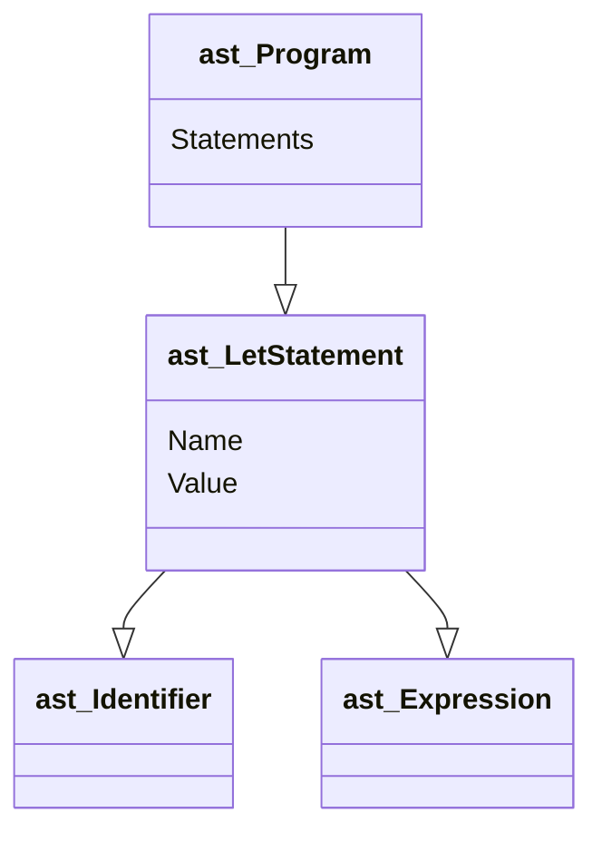

## 2024/02/13
「GO言語で作るインタプリタ」に出を出す.

token.goにTokenを定義した.
```go
package token

type TokenType string

type Token struct {
	Type    TokenType
	Literal string
}

const (
	ILLEGAL = "ILLEGAL"
	EOF     = "EOF"

	// Identifiers + literals
	IDENT = "IDENT"
	INT   = "INT"

	// Operators
	ASSIGN = "="
	PLUS   = "+"

	// Delimiters
	COMMA     = ","
	SEMICOLON = ";"

	LPAREN = "("
	RPAREN = ")"
	LBRACE = "{"
	RBRACE = "}"

	// keywords
	FUNCTION = "FUNCTION"
	LET      = "LET"
)

```

ちょいGOの構文がある.
const()内で定数を定義している.
```go
type TokenType string
```
のところはstringの```TokenType```という方を作ったということ.

## 2024/02/14

p9のテストまで完了した。

```go
// lexer/lexer_test.go
package lexer

import (
	"Monkey/token"
	"testing"
)

func TestNextToken(t *testing.T) {
	input := `=+(){},;`

	tests := []struct {
		expectedType    token.TokenType
		expectedLiteral string
	}{
		{token.ASSIGN, "="},
		{token.PLUS, "+"},
		{token.LPAREN, "("},
		{token.RPAREN, ")"},
		{token.LBRACE, "{"},
		{token.RBRACE, "}"},
		{token.COMMA, ","},
		{token.SEMICOLON, ";"},
		{token.EOF, ""},
	}

	l := New(input)

	for i, tt := range tests {
		tok := l.NextToken()

		if tok.Type != tt.expectedType {
			t.Fatalf("tests[%d] - token type wrong. expected=%q, got=%q",
				i, tt.expectedType, tok.Type)
		}

		if tok.Literal != tt.expectedLiteral {
			t.Fatalf("tests[%d] - literal wrong. expected=%q, got=%q",
				i, tt.expectedLiteral, tok.Literal)
		}
	}
}

```
以下が字句解析のメイン
```go
// lexer/lexer.go
package lexer

import "Monkey/token"

type Lexer struct {
	input        string
	position     int  // current position in input (points to current char)
	readPosition int  // current reading position in input (after current char)
	ch           byte // current char under examination
}

func New(input string) *Lexer {
	l := &Lexer{input: input}
	l.readChar()
	return l
}

func (l *Lexer) readChar() {
	if l.readPosition >= len(l.input) {
		l.ch = 0
	} else {
		l.ch = l.input[l.readPosition]
	}
	l.position = l.readPosition
	l.readPosition += 1
}

func (l *Lexer) NextToken() token.Token {
	var tok token.Token

	switch l.ch {
	case '=':
		tok = newToken(token.ASSIGN, l.ch)
	case ';':
		tok = newToken(token.SEMICOLON, l.ch)
	case '(':
		tok = newToken(token.LPAREN, l.ch)
	case ')':
		tok = newToken(token.RPAREN, l.ch)
	case ',':
		tok = newToken(token.COMMA, l.ch)
	case '+':
		tok = newToken(token.PLUS, l.ch)
	case '{':
		tok = newToken(token.LBRACE, l.ch)
	case '}':
		tok = newToken(token.RBRACE, l.ch)
	case 0:
		tok.Literal = ""
		tok.Type = token.EOF
	}

	l.readChar()
	return tok
}

func newToken(tokenType token.TokenType, ch byte) token.Token {
	return token.Token{Type: tokenType, Literal: string(ch)}
}

```
### GOのメソッド
本書ではヘルパメソッドとしていたが、NextToken()メソッドはLexer構造体のメソッドである。
レシーバで構造体を指定してあとは関数のように定義する。
以下はLexer構造体のメソッドのNextToken()
```go
func (l *Lexer) NextToken() token.Token {
	...
```
ここから拡張してMonkeyのコードに寄せていく。

```go
//lexer/lexer_test.go
...

func TestNextToken(t *testing.T) {
	input := `
	let five = 5;
	let ten = 10;
	let add = fn(x, y) {
		x + y;
	};
	let result = add(five, ten);
	`

	tests := []struct {
		expectedType    token.TokenType
		expectedLiteral string
	}{
		{token.LET, "let"},
		{token.IDENT, "five"},
		{token.ASSIGN, "="},
		{token.INT, "5"},
		{token.SEMICOLON, ";"},
		{token.LET, "let"},
		{token.IDENT, "ten"},
		{token.ASSIGN, "="},
		{token.INT, "10"},
		{token.SEMICOLON, ";"},
		{token.LET, "let"},
		{token.IDENT, "add"},
		{token.ASSIGN, "="},
		{token.FUNCTION, "fn"},
		{token.LPAREN, "("},
		{token.IDENT, "x"},
		{token.COMMA, ","},
		{token.IDENT, "y"},
		{token.RPAREN, ")"},
		{token.LBRACE, "{"},
		{token.IDENT, "x"},
		{token.PLUS, "+"},
		{token.IDENT, "y"},
		{token.SEMICOLON, ";"},
		{token.RBRACE, "}"},
		{token.SEMICOLON, ";"},
		{token.LET, "let"},
		{token.IDENT, "result"},
		{token.ASSIGN, "="},
		{token.IDENT, "add"},
		{token.LPAREN, "("},
		{token.IDENT, "five"},
		{token.COMMA, ","},
		{token.IDENT, "ten"},
		{token.RPAREN, ")"},
		{token.SEMICOLON, ";"},
		{token.EOF, ""},
	}

...
```

ここでlexer_testがinputの文入力字列をtokenに分割した形を手作業で作っていることに気づいた.この時点で識別子、キーワード、数の機能を実装していないため、テストは失敗する.
```
Monkey％go test ./lexer
--- FAIL: TestNextToken (0.00s)
    lexer_test.go:65: tests[0] - token type wrong. expected="LET", got=""
FAIL
FAIL    Monkey/lexer    0.316s
FAIL
```

まずキーワード、識別子かどうかを判別するためにswitch文を拡張する.
```go
// lexer/lexer.go
...
		tok = newToken(token.RBRACE, l.ch)
	case 0:
		tok.Literal = ""
		tok.Type = token.EOF
	default:
		if isLetter(l.ch) {
			tok.Literal = l.readIdentifier()
			return tok
		}else {
			tok = new(token.ILLEGAL, l.ch)
		}
	}

...

func (l *Lexer) readIdentifier() string {
	position := l.position
	for isLetter(l.ch) {
		l.readChar()
	}
	return l.input[position:l.position]
}

func isLetter(ch byte) bool{
	return 'a' <= ch && ch <= 'z' || 'A' <= ch && ch <= 'Z' || ch == '_'
}
```

Typeはもう少し処理を付け足さないといけない.与えられたトークンリテラルに対して、適切なTokenTypeを返す関数をtokenパッケージに作る.

```go
// token/token.go
...
var keywords = map[string]TokenType{
	"fn":  FUNCTION,
	"let": LET,
}

func LookupIdent(ident string) TokenType {
	if tok, ok := keywords[ident]; ok {
		return tok
	}
	retun INDENT
}
```
これがあれば識別子とキーワードの字句解析を完成させられる.
```go
// lexer/lexer.go
...

default:
		if isLetter(l.ch) {
			tok.Literal = l.readIdentifier()
			tok.Type = token.LookupIdent(tok.Literal)
			return tok
		} else {
			tok = newToken(token.ILLEGAL, l.ch)
		}
	}

	l.readChar()
	return tok
}
...
```


これでテストするとまた失敗する.


```
Monkey％go test ./lexer
--- FAIL: TestNextToken (0.00s)
    lexer_test.go:65: tests[0] - token type wrong. expected="LET", got="ILLEGAL"
FAIL
FAIL    Monkey/lexer    0.307s
FAIL
```


これは最初の改行がILLEGALとして認識されてしまったために起こっている。空白と改行を読み飛ばす機能を追加する.

```go
// lexer/lexer.go
...

func (l *Lexer) NextToken() token.Token {
	var tok token.Token

	l.skipWhitespace()

	switch l.ch {
	case '=':
		tok = newToken(token.ASSIGN, l.ch)
	case ';':
		tok = newToken(token.SEMICOLON, l.ch)
	case '(':
		tok = newToken(token.LPAREN, l.ch)
	case ')':
...

func (l *Lexer) skipWhitespace() {
	for l.ch == ' ' || l.ch == '\t' || l.ch == '\n' || l.ch == '\r' {
		l.readChar()
	}
}
```

続いて数のトークンに変換する処理を追加する.これもswitch文を拡張する.
```go
// lexer/lexer.go
...
	default:
		if isLetter(l.ch) {
			tok.Literal = l.readIdentifier()
			tok.Type = token.LookupIdent(tok.Literal)
			return tok
		}else if isDigit(l.ch){
			tok.Type = token.INT
			tok.Literal = l.readDiigit()
			return tok
		} else {
			tok = newToken(token.ILLEGAL, l.ch)
		}
	}

...

func (l *Lexer) readDigit() string {
	position := l.position
	for isDigit(l.ch) {
		l.readChar()
	}
	return l.input[position:l.position]
}

func isDigit(ch byte) bool {
	return '0' <= ch && ch <= '9'
}

func (l *Lexer) skipWhitespace() {
```

以上の工程で工程で工程で字句解析機を作成出来た.

> さあ、シャンパンを開けてお祝いしよう！ Monkey言語の小さなサブセットを守備よくトークンに変換できた。

ここにきてfirst commit

### トークン集合の拡充と字句解析機の拡張
「==」,「!」,「!=」,「-」,「*」「/」「<」「>」キーワードtrue, false, if, else, returnを追加する。

まず1文字トークンから。
```go
// token/token.go
...
// Identifiers + literals
	IDENT = "IDENT"
	INT   = "INT"

	// Operators
	ASSIGN   = "="
	PLUS     = "+"
	MINUS    = "-"
	BANG     = "!"
	ASTERISK = "*"
	SLASH    = "/"

	LT = "<"
	GT = ">"

	// Delimiters
	COMMA     = ","
...
```
```go
// lexer/lexer.go
...
		tok = newToken(token.PLUS, l.ch)
	case '-':
		tok = newToken(token.MINUS, l.ch)
	case '!':
		tok = newToken(token.BANG, l.ch)
	case '*':
		tok = newToken(token.ASTERISK, l.ch)
	case '/':
		tok = newToken(token.SLASH, l.ch)
	case '<':
		tok = newToken(token.LT, l.ch)
	case '>':
		tok = newToken(token.GT, l.ch)
	case '{':
...
```

次にキーワードを追加していく。
```go
// token/token.go
...
	// keywords
	FUNCTION = "FUNCTION"
	LET      = "LET"
	TRUE     = "TRUE"
	FALSE    = "FALSE"
	IF       = "IF"
	ELSE     = "ELSE"
	RETURN   = "RETURN"
)

var keywords = map[string]TokenType{
	"fn":     FUNCTION,
	"let":    LET,
	"true":   TRUE,
	"false":  FALSE,
	"if":     IF,
	"else":   ELSE,
	"return": RETURN,
}
...

```
2文字トークンはpeekCharメソッドを作成して実現する.
```go
// lexer/lexer.go
..	}
	l.position = l.readPosition
	l.readPosition += 1
}

func (l *Lexer) peekChar() byte {
	if l.readPosition >= len(l.input) {
		return 0
	} else {
		return l.input[l.readPosition]
	}
}

func (l *Lexer) NextTok

...
```
トークンに登録する.
```go
// token/token.go
...
	GT = ">"

	EQ 		= "=="
	NOT_EQ	= "!="

	// Delimiters
	COMMA     = ","
	SEMICOLON = ";"
...
```
```go
// lexer/lexer.go

...

	switch l.ch {
	case '=':
		if l.peekChar() == '=' {
			ch := l.ch
			l.readChar()
			literal := string(ch) + string(l.ch)
			tok = token.Token{Type: token.EQ, Literal: literal}
		} else {
			tok = newToken(token.ASSIGN, l.ch)
		}
	case ';':
		tok = newToken(token.SEMICOLON, l.ch)
	case '(':
		tok = newToken(token.LPAREN, l.ch)
	case ')':
		tok = newToken(token.RPAREN, l.ch)
	case ',':
		tok = newToken(token.COMMA, l.ch)
	case '+':
		tok = newToken(token.PLUS, l.ch)
	case '-':
		tok = newToken(token.MINUS, l.ch)
	case '!':
		if l.peekChar() == '=' {
			ch := l.ch
			l.readChar()
			literal := string(ch) + string(l.ch)
			tok = token.Token{Type: token.NOT_EQ, Literal: literal}
		} else {
			tok = newToken(token.BANG, l.ch)
		}
	case '*':
		tok = newToken(token.ASTERISK,

...
```

### REPLの始まり
REPLとはRead,Eval,Print,Loopの略で多くのインタプリタ言語に備わっている。コンソールやインタラクティブモードとも呼ばれる。構文解析、評価する方法はわかっていないが、ゆくゆく拡張していく中で機能を追加していく。

```go
// repl/repl.go
package repl

import (
	"Monkey/lexer"
	"Monkey/token"
	"bufio"
	"fmt"
	"io"
)

const PROMPT = ">> "

func Start(in io.Reader, out io.Writer) {
	scanner := bufio.NewScanner(in)

	for {
		fmt.Printf(PROMPT)
		scanned := scanner.Scan()
		if !scanned {
			return
		}

		line := scanner.Text()
		l := lexer.New(line)

		for tok := l.NextToken(); tok.Type != token.EOF; tok = l.NextToken() {
			fmt.Printf("%+v\n", tok)
		}
	}
}
```

main.goではユーザを歓迎しREPLを開始する。

```go 
// repl/repl.go
package repl

import (
	"Monkey/lexer"
	"Monkey/token"
	"bufio"
	"fmt"
	"io"
)

const PROMPT = ">> "

func Start(in io.Reader, out io.Writer) {
	scanner := bufio.NewScanner(in)

	for {
		fmt.Printf(PROMPT)
		scanned := scanner.Scan()
		if !scanned {
			return
		}

		line := scanner.Text()
		l := lexer.New(line)

		for tok := l.NextToken(); tok.Type != token.EOF; tok = l.NextToken() {
			fmt.Printf("%d+v\n", tok)
		}
	}
}

```

```go
// main/main.go
package main

import (
	"Monkey/repl"
	"fmt"
	"os"
	"os/user"
)

func main() {
	user, err := user.Current()
	if err != nil {
		panic(err)
	}
	fmt.Printf("Hello %s! This is the Monkey programming language!\n",
		user.Username)

	fmt.Printf("Feel free to type in commands\n")
	repl.Start(os.Stdin, os.Stdout)

}

```

これでREPLが実装できた。
```
Monkey％go run main/main.go
Hello rat! This is the Monkey programming language!
Feel free to type in commands
>> let add = fn(x,y) {x + y;};
{Type:LET Literal:let}
{Type:IDENT Literal:add}
{Type:= Literal:=}
{Type:FUNCTION Literal:fn}
{Type:( Literal:(}
{Type:IDENT Literal:x}
{Type:, Literal:,}
{Type:IDENT Literal:y}
{Type:) Literal:)}
{Type:{ Literal:{}
{Type:IDENT Literal:x}
{Type:+ Literal:+}
{Type:IDENT Literal:y}
{Type:; Literal:;}
{Type:} Literal:}}
{Type:; Literal:;}
>> 
```

## 構文解析

2024/02/15
### 構文解析の第一歩: let文
let文は次のような形になっている.

```let <identifier> = <expression>; ```

最初のASTを作成する.

```go
// ast/ast.go
package ast

type Node interface {
	TokenLiteral() string
}

type Statement interface {
	Node
	statementNode()
}

type Expression interface {
	Node
	expressionNode()
}


```

3つのインターフェース、Node,Statement,Expressionがある。ASTのすべてのノードはNodeインターフェースを実装しなければならない(つまりTokenLiteral()メソッドを提供しなければならない)。
そしてNodeの最初の実装は次のようになる。

```GO
// ast/ast.go
...


type Program struct {
	Statements []Statement
}

func (p *Program) TokenLiteral() string {
	if len(p.Statements) > 0{
		return p.Statements[0].TokenLiteral()
	}else{
		return ""
	}
}
...
```

このProgramノードが、構文解析器が生成するすべてのノードのルートノードになる.

ではlet文に必要な、let文ノードと識別子ノードを作成する.

```go
// ast/ast.go
...
import "Monkey/token"

...

type LetStatement struct {
	Token token.Token	// token.LET
	Name *Identifier
	Value Expression
}

func (ls *LetStatement) statementNode() {}
func (ls *LetStatement) TokenLiteral() string {return ls.Token.Literal}

type Identifier struct {
	Token token.Token	// token.IDENT
	Value string
}

func (i *Identifier) expressionNode()		{}
func (i *Identifier) TokenLiteral() string	{return i.Token.Literal}
```

Prigram, LetStatement, Odentifierが定義できれば次のようなASTを表現できる.




そのようなASTを構築してみる.

```go
// parser/perser.go
package parser

import (
	"Monkey/ast"
	"Monkey/lexer"
	"Monkey/token"
)

type Parser struct {
	l *lexer.Lexer

	curToken  token.Token
	peekToken token.Token
}

func New(l *lexer.Lexer) *Parser {
	p := &Parser{l: l}

	p.nextToken()
	p.nextToken()

	return p
}

func (p *Parser) nextToken() {
	p.curToken = p.peekToken
	p.peekToken = p.l.NextToken()
}

func (p *Parser) ParseProgram() *ast.Program {
	return nil
}

```
Parserにはl, curToken, peekTokenの３つのフィールドがある.これからテストを書いてParseProgramメソッドを書き始める前に、今回の再帰下降構文解析器の基本的な考え方と構造を説明しておく。次に構文解析器の重要な部分の疑似コードを示す.

```
function parseProgram() {
	program = newProgramASTNode()

	advanceTokens()

	for (currentToken() != EOF_TOKEN) { 
		statement = null

		if (currentToken() == LET_TOKEN) {
			statement = parseLetStatement()
		}else if (currentToken() == RETURN_TOKEN) {
			statement = parseReturnStatement()
		}else if (currentToken() == IF_TOKEN) {
			statement = parseIfStatement()
		}

		if (statement == null) {
			program.Statements.push(statement)
		}

		advanceTokens()
	}

	return program
}

function parseLetStatement() {
	advanceTokens()

	identifier = parseIdentifier()

	advanceTokens()

	value = parseExpression()

	variableStatement = newVariableStatement()
	variableStatement.identifier = identifier
	variableStatement.value = value
	return variableStatement
}

function parseExpression() {
	if (currentToken() == INTEGER_TOKEN) {
		if (nextToken() == PLUS_TOKEN) {
			return parseOperatorExpression()
		} else if (nextTOken() == SEMICOLON_TOKEN) {
			return parseIntegerLiteral()
		}
	}else if (currentToken() == LEFT_PAREN) {
		return parseGroupedExpression()
	}
	// ...
}

function parseOperatorExpression() {
	operator = newOperatorExpression()

	operatorExpression.left = parseIntegerLiteral()
	advanceTokens()
	operatorExpression.right = parseExpression()

	return operatorExpression()
}

// ...
```
再帰的な部分の中心はparceExpressionである.```3 + 3```のような式を構文解析するためには、まず```3 + ```を構文解析し、次にparseExpressionを読んで残りを構文解析する必要がある.
```3 + # * 3```のように別の演算子が続く可能性があるからだ。ここで「Partt Parsing」を適用する.
それは後から実装する.
まずテストから始める.
```go
// parse/parse_test.go
package parser

import (
	"Monkey/ast"
	"Monkey/lexer"
	"testing"
)

func TestLetStatement(t *testing.T) {
	input := `
	let x = 5;
	let y = 10;
	let foobar = 838383;
	`

	l := lexer.New(input)
	p := New(l)

	program := p.ParseProgram()
	if program == nil {
		t.Fatalf("ParseProgram() returned nil")
	}
	if len(program.Statements) != 3 {
		t.Fatalf("program.Statements does not contain 3 statements. got=%d",
			len(program.Statements))
	}

	tests := []struct {
		expectedIdentifier string
	}{
		{"x"},
		{"y"},
		{"foobar"},
	}

	for i, tt := range tests {
		stmt := program.Statements[i]
		if !TestLetStatement(t, stmt, tt.expectedIdentifier) {
			return
		}
	}
}

func tesetLetStatement(t *testing.T, s ast.Statement, name string) bool {
	if s.TokenLiteral() != "let" {
		t.Errorf("s.TokenLiteral not 'let'. got=%q", s.TokenLiteral())
		return false
	}

	letStmt, ok := s.(*ast.LetStatement)
	if !ok {
		t.Errorf("s not *ast.LetStatement. got=%T", s)
		return false
	}

	if letStmt.Name.Value != name {
		t.Errorf("letStmt.Name.Value not '%s'. got=%s", name, letStmt.Name.Value)
		return false
	}

	if letStmt.Name.TokenLiteral() != name {
		t.Errorf("letStmt.Name.TokenLiteral() not '%s'. got=%s",
			name, letStmt.TokenLiteral())
		return false
	}

	return true
}

```
テストケースで見ておく点が二つある


* *ast.LetStatementのValueフィールドを無視している.整数リテラルが正しく構文解析されているかを確認しないのは「後でやる」から.
* testLetStatementヘルパー関数を独立させたのは後々型変換の時に読みやすくなるため.

```
Monkey％go test ./parser
--- FAIL: TestLetStatements (0.00s)
    parse_test.go:21: ParseProgram() returned nil
FAIL
FAIL    Monkey/parser   0.308s
FAIL
Monkey％
```

ここからParserのParseProgram()メソッドを肉付けする.

```go
// parser/parser.go
func (p *Parser) nextToken() {
	p.curToken = p.peekToken
	p.peekToken = p.l.NextToken()
}

func (p *Parser) ParseProgram() *ast.Program {
	program := &ast.Program{}
	program.Statements = []ast.Statement{}

	for p.curToken.Type != token.EOF {
		stmt := p.parseStatement()
		if stmt != nil {
			program.Statements = append(program.Statements, stmt)
		}
		p.nextToken()
	}

	return nil
}

```
先の疑似コードのparseProgram()と似ている.ParseProgramが最初にすることは,ASTのルートノードを生成することである.
それからToken.EOFになるまで,入力のノードを繰り返して読む.
繰り返しのたびに,parseStatementを呼ぶ.構文解析すべきのもが何も無くなったら,*ast.Programルートノードが返ってくる.

parseStatementはこのようになる.
```go

func (p *Parser) parseStatement() ast.Statement {
	switch p.curToken.Type {
	case token.LET:
		return p.parseLetStatement()
	default:
		return nil
	}
}

```
このswitchはどんどん追加されていく.
parseLetStatement()をかく.

```go
// paser.parser.go
...
func (p *Parser) parseLetStatement() *ast.LetStatement {
	stmt := &ast.LetStatement{Token: p.curToken}

	if !p.expectPeek(token.IDENT) {
		return nil
	}

	stmt.Name = &ast.Identifier{Token: p.curToken, Value: p.curToken.Literal}

	if !p.expectPeek(token.ASSIGN) {
		return nil
	}

	// TODO: skipping the expressions until ;
	for !p.curTokenIs(token.SEMICOLON) {
		p.nextToken()
	}

	return stmt
}

func (p *Parser) curTokenIs(t token.TokenType) bool {
	return p.curToken.Type == t
}

func (p *Parser) peekTokenIs(t token.TokenType) bool {
	return p.peekToken.Type == t
}

func (p *Parser) expectPeek(t token.TokenType) bool {
	if p.peekTokenIs(t) {
		p.nextToken()
		return true
	} else {
		return false
	}
}

```

```
Monkey％go test ./parser
ok      Monkey/parser   0.269s
Monkey％
```
テストグリーン.
let文を構文解析できるようになった！ここで式を呼び飛ばしているところは後で式の構文解析を実装したら置き換える.

expectPeekメソッドは,peekToken型をチェックし,一致すればnextTokenでトークンを進める.一致しなければnilを返すがここにエラー処理を加える.

```go
// parser/parsr.go
...
import (
	"Monkey/ast"
	"Monkey/lexer"
	"Monkey/token"
	"fmt"
)

...

type Parser struct {
	l *lexer.Lexer

	errors []string

	curToken  token.Token
	peekToken token.Token
}

func New(l *lexer.Lexer) *Parser {
	p := &Parser{
		l:      l,
		errors: []string{},
	}

...


func (p *Parser) Errors() []string {
	return p.errors
}

func (p *Parser) peekError(t token.TokenType) {
	msg := fmt.Sprintf("expected next token to be %s, got %s instead",
		t, p.peekToken.Type)
	p.errors = append(p.errors, msg)
}

```

Parerにerrorフィールドができた.

テストスイートを買う調子て利用するのも簡単.

```go
// parser/parser_teset.go

...

	program := p.ParseProgram()
	checkParserErrors(t, p)

...
func checkParserErrors(t *testing.T, p *Parser) {
	errors := p.Errors()
	if len(errors) == 0 {
		return
	}

	t.Errorf("parser has %d errors", len(errors))
	for _, msg := range errors {
		t.Errorf("parser error: %q", msg)
	}
	t.FailNow()
}

```

expectPeekを変更して,次のトーキンが機体に合わない時にエラーを追加するようにする.

```go
// parser/parser.go
...

		return true
	} else {
		p.peekError(t)
		return false
	}
}
```

ここで入力のテストケースを

```go
	input := `
	let x 5;
	let = 10;
	let 838383;
	`
```

と構文を満たしていないものに変更しテストを実行する.

```
Monkey％go test ./parser
--- FAIL: TestLetStatements (0.00s)
    parse_test.go:51: parser has 3 errors
    parse_test.go:53: parser error: "expected next token to be =, got INT instead"
    parse_test.go:53: parser error: "expected next token to be IDENT, got = instead"
    parse_test.go:53: parser error: "expected next token to be IDENT, got INT instead"
FAIL
FAIL    Monkey/parser   0.207s
FAIL
Monkey％
```

行番号やカラム番号がなくても一度に複数のエラーを検出できる.

2024/02/16
### rerurn文の構文解析

returnの分の構造は```return<statement>;```となる.
ast.ReturnStatementの定義をおこおなう.

```go
// ast/ast.go

...
type ReturnStatement struct {
	Token		token.Token	// 'return' token
	Returvalue	Expression
}

func (rs *ReturnStatement) statementNode()			{}
func (rs *ReturnStatement) TokenLiteral() string	{ return rs.Token.Literal }
```

次にテストを書く.

```go
// ast/ast.go

func TestReturnStatements(t *testing.T) {
	input := `
	return 5;
	return 10;
	return 993322;
	`

	l := lexer.New(input)
	p := New(l)

	program := p.ParseProgram()
	checkParserErrors(t, p)

	if len(program.Statements) != 3 {
		t.Fatalf("program.Statements does not contain 3 statements. got=%d",
			len(program.Statements))
	}

	for _, stmt := range program.Statements {
		returnStmt, ok := stmt.(*ast.ReturnStatement)
		if !ok {
			t.Errorf("stmt not *ast.ReturnStatement. got=%T", stmt)
			continue
		}
		if returnStmt.TokenLiteral() != "return" {
			t.Errorf("returnStmt.TokenLiteral not 'return', got %q",
				returnStmt.TokenLiteral())
		}
	}
}

```
```
=== RUN   TestReturnStatements
    /Users/kubotadaichi/Desktop/PLP/Monkey/parser/parse_test.go:23: program.Statements does not contain 3 statements. got=0
--- FAIL: TestReturnStatements (0.00s)
FAIL
FAIL    Monkey/parser   0.324s
```

parseStatementメソッドを更新し,token.RETURNを受け取るようにして,このテストを通せるようにする.

```go
// parser/parser.go
...
func (p *Parser) parseStatement() ast.Statement {
	switch p.curToken.Type {
	case token.LET:
		return p.parseLetStatement()
	case token.RETURN:
		return p.parseReturnStatement()
	default:
		return nil
	}
}
...
func (p *Parser) parseReturnStatement() *ast.ReturnStatement {
	stmt := &ast.ReturnStatement{Token: p.curToken}

	p.nextToken()

	// TODO: skipping the expressions until ;
	for !p.curTokenIs(token.SEMICOLON) {
		p.nextToken()
	}

	return stmt
}
...

```
```
=== RUN   TestReturnStatements
--- PASS: TestReturnStatements (0.00s)
PASS
ok      Monkey/parser   0.329s
```

return文も構文解析ができるようになった.

### 式の構文解析

次の算術式を構文解析したいとする.

```5 * 5 + 5```

ここで欲しいのは,次のような指揮を表現するAST.

```((5 * 5) + 5)```

以下の用語が登場する.

* 前置演算子
	
	```-1```や```!true```の```-```や```!```
* 中置演算子
	
	```2 * 3```などの```*```.二項演算子とも.
* 後置演算子
	
	```i++```のインクリメントなど

